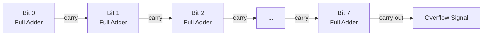

# Transistor Operation and Logic Gates

## Table of Contents

1. [Introduction](#1-introduction)
2. [Transistor Operation](#2-transistor-operation)
3. [Logic Gates](#3-logic-gates)
4. [Adders](#4-adders)
5. [Multi-Digit Addition](#5-multi-digit-addition)
6. [The 8-Bit Adder](#6-the-8-bit-adder)
7. [Binary Decoders](#7-binary-decoders)
8. [Instruction Identification](#8-instruction-identification)
9. [The Arithmetic Logic Unit](#9-the-arithmetic-logic-unit)
10. [Implementation Technology](#10-implementation-technology)
11. [Summary](#11-summary)

## 1. Introduction

This document describes the operation of a transistor. It describes how transistors are used to perform arithmetic operations and interpret instructions.

## 2. Transistor Operation

In the simplified bipolar-junction-transistor (BJT) switch model, a transistor has three terminals: a **collector**, an **emitter**, and a **base**. When the transistor is in its cutoff state, the collector-emitter path has high resistance. When sufficient base current drives the transistor into conduction, current can flow through the collector-emitter path. The model treats the transistor as a switch controlled by an electrical signal.

In an example circuit, a transistor turns an LED on and off. The base terminal acts as an input. The emitter terminal acts as an output. A switch mimics the input signal. The LED represents the output signal.

This configuration is a gate with one input. When the input is $0$, the output is $0$. When the input is $1$, the output is $1$.

In a second configuration, when the input is $0$, the LED is on. The arrangement of the circuit causes this behavior. Setting the input to $1$ causes the LED to turn off. The output is $0$. This configuration is an **inverter** or a **NOT gate**.

## 3. Logic Gates

Multiple transistors achieve complex behavior.

Two transistors connected in series:

| Input A | Input B | Output |
| :-----: | :-----: | :----: |
| 0 | 0 | 0 |
| 0 | 1 | 0 |
| 1 | 0 | 0 |
| 1 | 1 | 1 |

When both inputs are $0$, the output is $0$. Both transistors act as insulators. When either input is $0$, the output is $0$. The only way to obtain a $1$ in the output is to set both inputs to $1$. Both transistors act as conductors. This configuration is an **AND gate**. An AND gate outputs $1$ if and only if both inputs are $1$. Otherwise, the output is $0$.

Two transistors connected in parallel:

| Input A | Input B | Output |
| :-----: | :-----: | :----: |
| 0 | 0 | 0 |
| 0 | 1 | 1 |
| 1 | 0 | 1 |
| 1 | 1 | 1 |

When both transistors act as insulators, current cannot flow. Any transistor acting as a conductor allows current to flow. Setting both inputs to $1$ is not required to obtain an output of $1$. This configuration is an **OR gate**. An OR gate outputs $0$ if and only if both inputs are $0$. Otherwise, it outputs $1$.

These circuits are **logic gates**. A logic gate abstracts a circuit as a component with defined inputs and outputs. Logic gates have dedicated symbols. Inputs and outputs are electrical signals. The output of one logic gate connects to the input of another logic gate. Logic gates combine to achieve complex behavior.

Combining logic gates produces an **XOR gate**:

| Input A | Input B | Output |
| :-----: | :-----: | :----: |
| 0 | 0 | 0 |
| 0 | 1 | 1 |
| 1 | 0 | 1 |
| 1 | 1 | 0 |

An XOR gate outputs $0$ when both inputs are the same. An XOR gate outputs $1$ when the inputs differ.

## 4. Adders

Binary addition operates like decimal addition:

```math
0 + 0 = 0
```

```math
0 + 1 = 1
```

```math
1 + 0 = 1
```

```math
1 + 1 = 2
```

The value $2$ cannot be represented with a single binary digit. The addition overflows. An additional bit represents the value. A circuit that takes two input values and produces two outputs is required. The outputs are the **sum** and the **carry**.

The **sum** output requires a circuit that outputs $0$ when both inputs are the same and $1$ when the inputs differ. An XOR gate accomplishes this operation.

The **carry** output requires a circuit that outputs $1$ only when both inputs are $1$. An AND gate accomplishes this operation.

A circuit that adds two single-digit binary numbers combines an XOR gate and an AND gate. This circuit is a **half adder**.

## 5. Multi-Digit Addition

A half adder accepts two inputs. A half adder does not account for a carry from a previous addition. A **full adder** accepts the two bits being added and the carry from a previous addition. A full adder adds three single-digit binary numbers.

A full adder encapsulated in a box:

| Input A | Input B | Carry In | Sum | Carry Out |
| :-----: | :-----: | :------: | :-: | :-------: |
| 0 | 0 | 0 | 0 | 0 |
| 0 | 0 | 1 | 1 | 0 |
| 0 | 1 | 0 | 1 | 0 |
| 0 | 1 | 1 | 0 | 1 |
| 1 | 0 | 0 | 1 | 0 |
| 1 | 0 | 1 | 0 | 1 |
| 1 | 1 | 0 | 0 | 1 |
| 1 | 1 | 1 | 1 | 1 |

Full adders add multi-digit binary numbers. The carry output of each full adder feeds into the carry input of the next full adder. Adding binary numbers of $n$ digits requires $n$ full adders. Adding two 8-bit numbers requires eight full adders.

Values are represented using electrical signals. The output changes at the speed of the electrical signal when the input changes. Transistors are used for this operation. Logic gates are constructed from relays, 3D printed parts, marbles, or water. Transistors exceed these components in speed and compactness.

## 6. The 8-Bit Adder

An **8-bit adder** takes two 8-bit numbers as input. An 8-bit adder produces the sum of the inputs as another 8-bit number. An 8-bit adder provides an overflow signal. The overflow signal is the carry out output of the last full adder. The overflow signal informs whether the storage capacity represents the result of the operation. If both inputs are one byte long and the output is stored in one byte, information is lost. The result is an incorrect value. Monitoring the overflow output identifies the need for an extra byte.

> Operation overflows that are not managed produce undefined behavior.

A circuit that increments an input value uses an adder with the second input set to $1$. A **full subtractor** is constructed from logic gates. A full subtractor builds an 8-bit subtractor. More complex components are constructed from these circuits.

### 6.1 Ripple-Carry Addition Algorithm

The full-adder chain described in Section 5 corresponds directly to a software algorithm for adding two $n$-bit values. The algorithm processes one bit position per iteration and propagates the carry output of one position into the carry input of the next position, matching the hardware carry chain.

```text
function RIPPLE_CARRY_ADD(a[0..n-1], b[0..n-1]):
    # a and b hold n bits each, index 0 is the least significant bit
    if n = 0:
        return (sum = [], overflow = 0)     # empty input; no bit positions to add
    sum = array of n bits
    carry = 0
    for i from 0 to n - 1:
        sum[i] = a[i] XOR b[i] XOR carry         # matches the sum output in Section 4
        carry = (a[i] AND b[i]) OR (carry AND (a[i] XOR b[i]))  # matches the carry output
    overflow = carry                        # carry out of the most significant position
    return (sum, overflow)
```

The per-iteration expressions for `sum[i]` and `carry` implement the full-adder truth table in Section 5: `sum[i]` is $1$ when an odd number of the three inputs are $1$, and `carry` is $1$ when at least two of the three inputs are $1$. The `overflow` value returned after the loop is the carry out of the most significant bit position, matching the overflow signal described earlier in this section. When $n = 0$, the loop does not execute and the function returns immediately, which corresponds in hardware to a circuit with no full adders and no carry chain.



### 6.2 Overflow Detection in Real Instruction Sets

Production processors expose the adder's carry-out and a derived signed-overflow indicator as status flags set by the arithmetic instruction itself, rather than requiring software to inspect the carry chain directly.

| Architecture | Instruction | Unsigned Overflow (Carry) Flag | Signed Overflow Flag |
| :--- | :--- | :--- | :--- |
| x86-64 | `add` | `CF` (Carry Flag) | `OF` (Overflow Flag) |
| ARM64 (AArch64) | `adds` | `C` (bit 29 of `NZCV`) | `V` (bit 28 of `NZCV`) |

On x86-64, `add` performs the addition described in Sections 4 through 6 and sets `CF` when the carry out of the most significant bit indicates unsigned overflow and `OF` when the result indicates signed (two's-complement) overflow.

```asm
mov   al, 0xFF        ; al = 255 (unsigned) / -1 (signed, two's complement)
add   al, 1            ; al = 0; CF = 1 (unsigned overflow); OF = 0 (no signed overflow)
```

On ARM64, the plain `add` instruction does not update flags; the `adds` form (`add`, setting flags) writes the same addition result and additionally sets the `C` and `V` bits of the `NZCV` condition-flags register.

```asm
mov   w0, #0xFFFFFFFF   ; w0 = 4294967295 (unsigned) / -1 (signed, two's complement)
adds  w0, w0, #1        ; w0 = 0; NZCV.C = 1 (unsigned overflow); NZCV.V = 0 (no signed overflow)
```

Both architectures distinguish the unsigned carry-out (`CF` / `C`) from the signed-overflow indicator (`OF` / `V`) because the same bit pattern in the adder's output can represent a valid unsigned result and an invalid signed result, or the reverse, depending on how the program interprets the operand bits.

### 6.3 References

- Intel Corporation, [Intel 64 and IA-32 Architectures Software Developer's Manuals](https://www.intel.com/content/www/us/en/developer/articles/technical/intel-sdm.html), for the `ADD` instruction's effect on `CF` and `OF`.
- Arm Limited, [Arm Architecture Reference Manual for A-profile Architecture](https://developer.arm.com/documentation/ddi0487/latest/), for the `ADDS` instruction and the `NZCV` condition-flags register.

## 7. Binary Decoders

A **binary decoder** receives a binary number. The binary number corresponds to the position of the output to activate. The decoder activates one output and deactivates all other outputs. When the decoder receives an input, one and only one output has the value of $1$. All other outputs have the value of $0$.

A decoder with three inputs controls eight outputs:

| Input | Output 0 | Output 1 | Output 2 | Output 3 | Output 4 | Output 5 | Output 6 | Output 7 |
| :---: | :------: | :------: | :------: | :------: | :------: | :------: | :------: | :------: |
| 000 | 1 | 0 | 0 | 0 | 0 | 0 | 0 | 0 |
| 001 | 0 | 1 | 0 | 0 | 0 | 0 | 0 | 0 |
| 010 | 0 | 0 | 1 | 0 | 0 | 0 | 0 | 0 |
| 011 | 0 | 0 | 0 | 1 | 0 | 0 | 0 | 0 |
| 100 | 0 | 0 | 0 | 0 | 1 | 0 | 0 | 0 |
| 101 | 0 | 0 | 0 | 0 | 0 | 1 | 0 | 0 |
| 110 | 0 | 0 | 0 | 0 | 0 | 0 | 1 | 0 |
| 111 | 0 | 0 | 0 | 0 | 0 | 0 | 0 | 1 |

A decoder with four inputs controls $16$ outputs. Decoders select among multiple options.

## 8. Instruction Identification

Assembly code is a representation of machine code. Machine code consists of ones and zeros. The instructions include arithmetic operations, instructions to fetch data from memory, and instructions to write data to memory.

In a basic architecture, an instruction is an arithmetic operation when its first two bits are $0$. NOR gates verify this condition.

The third and fourth bits determine the type of arithmetic operation to execute:

| Bits 3-4 | Operation |
| :------: | :-------- |
| 00 | Addition |
| 01 | Subtraction |

This value is the **opcode**. Each opcode is associated with one and only one kind of arithmetic operation.

## 9. The Arithmetic Logic Unit

The CPU determines that the current instruction is an arithmetic operation. The component receives the opcode. The component links the two bits to a decoder. The decoder identifies the internal operation.

All circuits receive the inputs and generate their respective outputs. The outputs of the decoder are interconnected. Only the output of the selected operation passes through the component.

This component is a version of an **arithmetic logic unit**. An arithmetic logic unit takes input values and an opcode. The opcode instructs the internal circuitry which arithmetic operation to perform between the values. The arithmetic logic unit produces the result of the specified operation. The arithmetic logic unit produces additional information, including whether the result is negative, zero, or has overflowed.

## 10. Implementation Technology

The bipolar junction transistor (BJT) model in Section 2, with a collector, an emitter, and a base, illustrates the switch behavior of a transistor. It is not the transistor type used to build logic gates in modern processors and memory. Modern digital logic uses the **metal-oxide-semiconductor field-effect transistor (MOSFET)**, described in detail in [Dynamic Random-Access Memory](03-dram.md). A MOSFET has a gate, a source, and a drain. Voltage applied to the gate, rather than current applied to a base, controls conduction between the source and the drain.

Processors and static memory implement logic gates using **complementary metal-oxide-semiconductor (CMOS)** technology. A CMOS gate pairs an n-type MOSFET pull-down network with a p-type MOSFET pull-up network. For any stable output value, exactly one of the two networks provides a conducting path from the output to a supply rail (the pull-up network to the positive supply, the pull-down network to ground) while the other network is open. No conducting path connects the positive supply directly to ground in a stable state, so a CMOS gate does not draw static current between its supply rails; current is drawn from the supply only while the output switches and charges or discharges the capacitance of the connected wires and transistor gates. This is why CMOS gates dissipate less static power than BJT-based logic and why CMOS is the technology used in essentially all contemporary microprocessors, memory, and application-specific integrated circuits.

A conventional static CMOS implementation of each gate described in this document requires a fixed number of transistors, since each gate's pull-up network and pull-down network each require one transistor per input signal path.

| Gate or Circuit | Transistor Count (Static CMOS) |
| :--- | :---: |
| Inverter (NOT) | 2 |
| 2-input NAND or NOR | 4 |
| 2-input AND or OR (NAND/NOR plus inverter) | 6 |
| 2-input XOR | 8-12 (implementation dependent) |
| Full adder (one bit) | 28 |

The full-adder transistor count reflects the conventional decomposition into XOR and AND-OR-invert gates described in Sections 4 and 5; alternative transistor-level designs, such as transmission-gate adders, reduce this count at the cost of design complexity (Ramireddy and Singh, "Comparative Performance Analysis of Full Adder Using CMOS and Transmission Gate Logic," available through the publisher).

The gate-level behavior described in Sections 2 through 9, truth tables, feedback, and Boolean combination, applies regardless of whether the underlying switch is a BJT or a MOSFET. The choice of transistor technology changes power consumption, switching speed, and manufacturing density. It does not change the logical behavior of AND, OR, NOT, XOR, or the circuits built from them.

> A logic gate's truth table describes its behavior independent of the transistor technology used to implement it. CMOS is the transistor technology used in virtually all modern digital logic.

### 10.1 Further Reading

- Institute of Electrical and Electronics Engineers, [IEEE Xplore Digital Library](https://ieeexplore.ieee.org/), for peer-reviewed literature on CMOS logic families and VLSI design.
- Weste, N. and Harris, D., *CMOS VLSI Design*, for a full treatment of static and dynamic CMOS gate design (not freely available online; consult a library or publisher).
- [Texas Instruments SN74HC00 datasheet](https://www.ti.com/lit/ds/symlink/sn74hc00.pdf), a commercially available quad two-input NAND gate, for a concrete example of a manufactured CMOS logic device and its electrical specifications.

## 11. Summary

This document describes the operation of a transistor. This document describes the construction of logic gates from transistors. This document describes the construction of adders, subtractors, binary decoders, and an arithmetic logic unit from logic gates. This document describes the distinction between the bipolar-junction-transistor switch model used for explanation and the CMOS/MOSFET technology used in modern implementations. This document describes the ripple-carry addition algorithm and the overflow flags that real processor instructions expose. This document does not cover memory.
