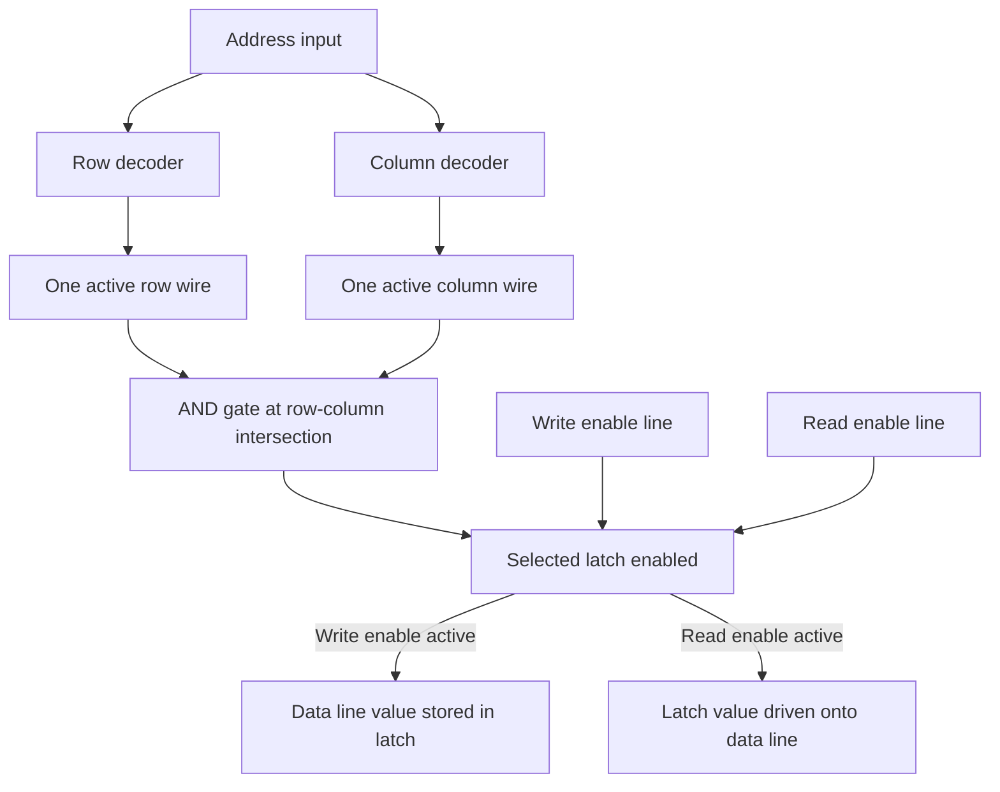

# Memory Circuits and Latches

## Table of Contents

1. [Introduction](#1-introduction)
2. [Feedback Circuits](#2-feedback-circuits)
3. [The AND-OR Latch](#3-the-and-or-latch)
4. [The Gated Latch](#4-the-gated-latch)
5. [Registers](#5-registers)
6. [Memory Matrices](#6-memory-matrices)
7. [Address Decoders](#7-address-decoders)
8. [Read and Write Operations](#8-read-and-write-operations)
9. [Byte-Addressable Memory](#9-byte-addressable-memory)
10. [The Address Bus](#10-the-address-bus)
11. [Memory Types](#11-memory-types)
12. [References](#12-references)
13. [Summary](#13-summary)

## 1. Introduction

This document describes the construction of memory circuits from transistors. The document covers feedback circuits, latches, registers, memory matrices, address decoders, read and write operations, byte-addressable memory, and the address bus. The document does not cover instruction execution or data flow between components.

## 2. Feedback Circuits

A circuit that retains information connects an output back to an input. This connection is a feedback path.

### 2.1 OR Gate Feedback

An OR gate outputs zero if and only if both inputs are zero. A feedback path connects the output to the second input.

The default state is defined with all signals off. The first input is set to one. The output changes to one. The output propagates to the second input. The second input becomes one. The output remains one regardless of the first input while the transistors are powered.

The circuit retains the value one.

### 2.2 AND Gate Feedback

An AND gate outputs one only when both inputs are one. A feedback path connects the output to the second input.

The first input is set to zero. The output becomes zero. The output propagates to the second input. The second input becomes zero. The output remains zero regardless of the first input.

The circuit retains the value zero.

### 2.3 Limitations

The OR gate feedback circuit retains only a one. The AND gate feedback circuit retains only a zero. A circuit that retains either a one or a zero requires both circuits.

## 3. The AND-OR Latch

### 3.1 Circuit Description

The AND-OR latch combines the OR gate feedback circuit and the AND gate feedback circuit. An inverter connects to the second input.

### 3.2 Set Operation

The first input is set to one. The AND gate output becomes one because the inverter supplies one to the other AND gate input. The AND gate output connects to an OR gate input. The first input is set to zero. The output remains one.

### 3.3 Reset Operation

The second input is set to one while the first input is zero. The inverter causes the AND gate to output zero. The output feeds back to the OR gate input. The second input is set to zero. The AND gate requires both inputs to be one to output one. The output remains zero.

### 3.4 Storage Capacity

The AND-OR latch retains one bit of information. The current value is read from the output wire.

### 3.5 Input Combination

Setting both inputs to one simultaneously is undefined. Setting the stored bit to one while resetting the stored bit to zero is not a valid operation.

## 4. The Gated Latch

### 4.1 Write Enable Input

A gated latch adds a write enable input to the AND-OR latch. The write enable input controls when the stored value is updated.

| Write Enable | Data | Result |
| :----------: | :--: | :----: |
| $0$ | $0$ | No change |
| $0$ | $1$ | No change |
| $1$ | $0$ | Store $0$ |
| $1$ | $1$ | Store $1$ |

### 4.2 Operation

When the write enable input is zero, the data signal is ignored. When the write enable input is one, the circuit retains the value on the data input. The value persists after the inputs return to zero. The stored value is overwritten by activating the write enable signal with a new data value.

### 4.3 Alternative Implementations

The gated latch is one implementation of a memory circuit. Other implementations exist.

## 5. Registers

### 5.1 Construction

A register is a collection of latches with a shared write enable input. An 8-bit register contains eight latches.

### 5.2 Operation

The shared write enable input overrides all latches simultaneously. The register stores one byte of information.

### 5.3 Types

Registers include general purpose registers, the instruction register, the address register, and the stack pointer.

### 5.4 Limitations

A register requires one wire per latch for data input and one wire per latch for data output. A 1 GB storage capacity requires billions of data wires.

## 6. Memory Matrices

### 6.1 Organization

A memory matrix arranges latches in a two-dimensional grid. A 4x4 matrix contains 16 latches. Four wires control the columns. Four wires control the rows.

### 6.2 Addressing

Activating one column wire and one row wire selects one latch. Each latch has a unique address. The address corresponds to the intersection of the activated row and column.

### 6.3 Address Mapping

The matrix address scheme mirrors the process of locating addresses on a map. Streets correspond to rows. Avenues correspond to columns.

## 7. Address Decoders

### 7.1 Decoder Function

A decoder activates one output for each input value. Input zero activates output zero. Input one activates output one.

### 7.2 Matrix Selection

One decoder controls the rows. One decoder controls the columns. An address input selects one row and one column. The selected row and column intersect at one latch.

### 7.3 Example

Input 0000 activates the first output of each decoder. Input 0001 activates the first output of the column decoder and the second output of the row decoder. The two inputs select different latches.

## 8. Read and Write Operations

### 8.1 Shared Data Line

A single data line serves as both input and output for a latch. The read enable input configures the data line as an output. When the read enable input is inactive, the data line functions as an input.

### 8.2 Read Operation

The read enable signal configures the data line as an output. The write enable signal is inactive. The inactive write enable signal disregards any input. The transistor prevents the signal from reaching the output.

### 8.3 Write Operation

The data line functions as an input. The write enable data is set to one. The current value stored in the latch is overwritten.

### 8.4 Matrix Wiring

The data lines of all latches connect to a general data line. The write enable inputs of all latches connect to a write enable line. The read enable inputs of all latches connect to a read enable line.

### 8.5 Latch Selection

An AND gate at each latch controls the write enable and read enable signals. The address input controls the decoders. The decoders activate one row wire and one column wire. The AND gate at the intersection produces an output of one. The signal flows to the selected latch.

### 8.6 Write Example

The write enable input is set to one. The address input selects a latch. The data line carries the new value. The selected latch changes its value. The address input changes. The write enable signal targets a different latch.

### 8.7 Read Example

An address is supplied. The read enable signal is activated. The signal targets the latch specified by the address. The data line acts as an output. The value of the selected latch is read.

### 8.8 Signal Propagation

The value of the read latch propagates to the input of all other latches. The write enable input of the other latches is inactive. The value in the other latches is not overwritten.

### 8.9 Address Decode and Selection Sequence

The following diagram shows the sequence of signal activations, described in Sections 7 and 8, that selects a single latch for a read or write operation.



### 8.10 Read and Write Algorithms

The matrix wiring in Section 8.4 and the AND-gate selection in Section 8.5 correspond to the following read and write operations.

```text
function MEMORY_WRITE(address, value):
    (row, column) = DECODE(address)   # row and column decoders each activate one wire
    activate row wire for row
    activate column wire for column
    set data line to value
    activate write enable line
    # the AND gate at (row, column) is the only gate driven by both an active
    # row wire and an active column wire, so exactly one latch is written

function MEMORY_READ(address):
    (row, column) = DECODE(address)
    activate row wire for row
    activate column wire for column
    activate read enable line
    # exactly one latch drives the data line; all other latches keep their
    # write enable input inactive and are unaffected
    return value on data line
```

An address decoder driven by an $n$-bit address bus has exactly $2^n$ outputs, one for every possible $n$-bit input value. Unlike an array index in software, an address presented on the bus cannot fall outside the decoder's range: every bit pattern the bus can carry activates exactly one output. A decode operation therefore has no out-of-range case to handle at this level; range checking, where it exists, is enforced by circuitry outside the memory matrix itself, such as the components described in [Memory Protection](16-memory-protection.md).

## 9. Byte-Addressable Memory

### 9.1 Bit Limitation

A single matrix stores single bits. A byte contains eight bits.

### 9.2 Matrix Array

Eight matrices store one byte. All matrices share the same address input. The read enable and write enable inputs are shared. Each matrix has its own data line.

### 9.3 Write Operation

The bits of the byte are input through the data lines. The write enable signal is activated. Each bit is stored in the corresponding latch at the specified address in each matrix.

### 9.4 Read Operation

The address is input. The read enable signal is activated. The data lines output the value of each bit at that address.

### 9.5 Abstraction

Memory is conceptualized as a list of bytes. Addresses are indices in the list. The term Random Access Memory describes the ability to point to any byte by providing its address.

## 10. The Address Bus

### 10.1 Definition

A bus is a set of wires.

### 10.2 Address Bus Width

The width of the address bus determines the number of addressable bytes. An 8-bit address bus with two decoders controls $256$ bytes. The general formula is $2^n$ bytes for an $n$-bit address bus.

### 10.3 Example

A 32-bit wide address bus addresses 4 billion bytes. A 32-bit computer handles up to 4 GB of RAM.

## 11. Memory Types

### 11.1 Static RAM

Static RAM (SRAM) uses logic gates arranged as a latch, as described in Sections 3 and 4. Static RAM is fast. A common implementation uses six transistors per bit: four transistors form two cross-coupled inverters that hold the stored value, and two additional access transistors connect the cell to a pair of complementary bit lines when a word line is activated. The transistor count per bit is why static RAM requires more chip area than dynamic RAM. The production cost per bit is higher.

| Property | Static RAM (SRAM) |
| :--- | :--- |
| Transistors per bit | Commonly $6$ |
| Storage mechanism | Cross-coupled logic gates (a latch) |
| Requires refresh | No |
| Typical use | Processor caches, register files |

### 11.2 Dynamic RAM

Dynamic RAM (DRAM) uses one MOSFET and one capacitor per cell. Dynamic RAM is cheaper to produce because the one-transistor, one-capacitor cell occupies less area than a six-transistor latch, which allows more bits per unit of chip area. Dynamic RAM is slower than static RAM and requires periodic refreshing. [Dynamic Random-Access Memory](03-dram.md) describes the DRAM cell, the read and write operations, and the refresh operation.

## 12. References

- JEDEC Solid State Technology Association, [JESD79 series](https://www.jedec.org/standards-documents/docs/jesd-79-4c), the industry standard specifications for DDR SDRAM (DDR3, DDR4, DDR5) electrical and timing characteristics.
- Institute of Electrical and Electronics Engineers, [IEEE Xplore Digital Library](https://ieeexplore.ieee.org/), for peer-reviewed literature on SRAM and DRAM cell design.

## 13. Summary

This document describes the construction of memory circuits from transistors. The document covers feedback circuits, the AND-OR latch, the gated latch, registers, memory matrices, address decoders, read and write operations, byte-addressable memory, the address bus, static RAM, and dynamic RAM. The document does not cover instruction execution, data flow between components, or a detailed comparison of memory types.
