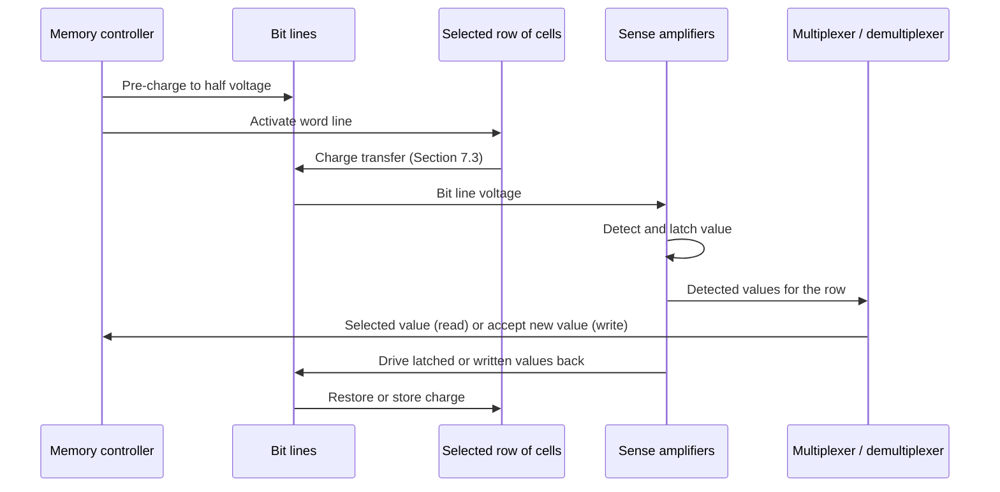

# Dynamic Random-Access Memory

## Table of Contents

1. [Introduction](#1-introduction)
2. [Capacitors](#2-capacitors)
3. [MOSFETs](#3-mosfets)
4. [The Dynamic Memory Cell](#4-the-dynamic-memory-cell)
5. [Comparison with Static RAM](#5-comparison-with-static-ram)
6. [Memory Cell Matrix Organization](#6-memory-cell-matrix-organization)
7. [The Read Operation](#7-the-read-operation)
8. [The Write Operation](#8-the-write-operation)
9. [Operation Sequence](#9-operation-sequence)
10. [Capacitor Leakage](#10-capacitor-leakage)
11. [The Refresh Operation](#11-the-refresh-operation)
12. [Timing and Address Handling](#12-timing-and-address-handling)
13. [Byte Addressing](#13-byte-addressing)
14. [Real-World DDR SDRAM](#14-real-world-ddr-sdram)
15. [Summary](#15-summary)

## 1. Introduction

This document describes the operation of dynamic random-access memory (DRAM). The document covers the storage mechanism, the read operation, the write operation, the refresh operation, and the differences between dynamic RAM and static RAM. The document does not cover the internal design of sense amplifiers, specific timing values for DRAM operation, or the details of DDR5 memory.

## 2. Capacitors

A capacitor is an electronic device that stores electric charge. When the terminals of a capacitor connect to a voltage source, current flows and the capacitor accumulates energy. The capacitor retains the stored energy after disconnection from the power source.

A charged capacitor stores electrical energy. The stored energy can be released through a circuit. A capacitor and a battery use different mechanisms for storing energy.

## 3. MOSFETs

A MOSFET is a transistor suited for miniaturization and computer applications. The MOSFET has three terminals: the gate, the source, and the drain.

A voltage applied to the gate allows current to flow from the source to the drain. Under certain conditions, current flows in the reverse direction.

## 4. The Dynamic Memory Cell

A MOSFET and a capacitor form a memory cell. The gate of the MOSFET controls the flow of current that charges the capacitor. After the capacitor charges, the interruption of current flow preserves the charge. The gate allows current to flow in the opposite direction to discharge the capacitor.

The discharged state represents a zero. The charged state represents a one. The circuit stores one bit of information.

## 5. Comparison with Static RAM

A static memory cell uses logic gates in an arrangement that traps a value as an electrical signal. The signal holds the value after the inputs reset to the default states. A static memory cell is also known as a latch. A latch requires many transistors.

A dynamic memory cell requires one transistor and one capacitor. The dynamic memory cell occupies less area than the static memory cell. A given area holds more dynamic memory cells than static memory cells. Dynamic RAM achieves higher memory capacities with fewer components. Dynamic RAM is cost-effective to produce.

## 6. Memory Cell Matrix Organization

Individual handling of each memory cell requires a large number of wires. The cells are arranged in a matrix instead.

A single wire connects the sources of the MOSFETs along each column. The column wire is a **bit line**. A single wire connects the gates of the MOSFETs along each row. The row wire is a **word line**.

The matrix organization locates any cell by the intersection of two wires. A binary decoder selects a row. A second decoder selects a column. The two selections identify the intersection, or memory cell, to address. This intersection defines a memory address.

A decoder for bit line selection is not ideal. Bit lines carry data into the memory cells and out of the memory cells during a read operation. The activation of a word line causes all cells in that row to output their values. Signals cannot be sent to the outputs of a decoder.

## 7. The Read Operation

The read operation uses a pre-charge step, a sense amplifier, and a latch. For the following description, the RAM uses $1$ volt to represent a binary one and $0$ volts to represent a binary zero.

A bit line disconnected from ground acts as a capacitor. The bit line stores charge and holds a voltage for a few nanoseconds.

### 7.1 Pre-charge

The first step of the read operation pre-charges the bit lines to half the working voltage of the RAM. In this example, the pre-charge voltage is $0.5$ volts.

### 7.2 Word Line Activation

The decoder activates a word line. The activation opens the gate of all cells in that row.

### 7.3 Charge Transfer

For a cell holding a binary one, the capacitor voltage is greater than the bit line voltage. Charge flows out of the capacitor and slightly discharges the capacitor. The bit line gains charge and the bit line voltage increases.

For a cell storing a binary zero, the discharged capacitor has a lower voltage than the bit line. The open gates allow charge to flow from the bit line to the capacitor. The bit line loses charge and the bit line voltage decreases.

### 7.4 Sense Amplifiers

A sense amplifier at the end of each bit line compares its voltage with a reference voltage and detects the voltage change. A sense amplifier that detects a voltage above $0.5$ volts outputs $1$ volt. A sense amplifier that detects a voltage below $0.5$ volts outputs $0$ volts.

Each sense amplifier connects to a latch. The latch is similar to the latches used in static RAM. The bit line might not hold its charge long enough for the read operation. The sense amplifier stores the detected value in the latch as soon as detection occurs. The sense amplifier outputs the stored value after the bit line discharges.

### 7.5 Multiplexer

The value of a specific cell in the row is required. A multiplexer gathers the outputs of the sense amplifiers. The address input determines which output is sent to the output line. The multiplexer contains a decoder and logic gates.

### 7.6 Data Restoration

The read operation alters the state of the capacitors. The sense amplifier reads the value from the latch. The sense amplifier sends the value back to the bit lines. The bit lines restore the capacitors to the previous state.

## 8. The Write Operation

The write operation builds on the read operation. A voltage of $0$ or $1$ volts is applied to the source of the MOSFET. The activation of the bit line charges or discharges the capacitor according to the desired stored value.

Two challenges apply to the write operation. The write operation targets a specific memory cell and not all cells in the row. The existing read circuitry cannot be bypassed.

### 8.1 Combined Multiplexer and Demultiplexer Circuitry

Data flows in the opposite direction during a write operation. A multiplexer does not perform this function. A demultiplexer performs the opposite function of a multiplexer. The demultiplexer receives a single data input. A select input determines which output receives the input value.

The column circuitry that switches between these two roles is not a distinct named device; it is a combined multiplexer and demultiplexer, controlled by the same column-address decode, that selects a data path in one direction for a read operation and the opposite direction for a write operation. Real DRAM designs implement this function with **column select gates** (also called column I/O gating), transistor switches that connect a selected column's bit lines to a shared internal data bus for both directions of transfer. The ability to switch roles between read and write operations is required for memory operation.

### 8.2 Write Process

The write process resembles the read process. The bit lines charge to $0.5$ volts. The word line of the desired cell activates. All capacitors in that row charge or discharge and change the voltage of the bit lines. The sense amplifiers detect the changes and store the values.

The key difference is the direction of data flow. The address tells the demultiplexer which latch receives the input value. Only the targeted latch is overwritten. The sense amplifiers send all values back through the bit lines. Each capacitor charges or discharges according to the value received. The new value is written while the other values in the same row are rewritten to prevent data loss.

## 9. Operation Sequence

The read operation and the write operation share the following steps:

1. Pre-charge the bit lines.
2. Activate the word line.
3. Detect and store the values with the sense amplifiers.
4. Direct the values with the multiplexer or the demultiplexer.
5. Write the values back to the memory cells.

The operations occur in a few nanoseconds. The number of steps is greater than the number of steps in a static RAM operation.

Static RAM stores bits as electrical signals. Reading from a latch does not cause the latch to lose its value. Dynamic RAM is slower than static RAM because of the additional steps.



The operation sequence corresponds to the following algorithm. The algorithm makes explicit two boundary cases that Sections 7 through 11 describe in prose: a write that must restore the untouched cells in the same row, and an access that arrives while the target row is being refreshed.

```text
function DRAM_ACCESS(address, operation, write_value):
    (row, column) = SPLIT_ADDRESS(address)     # Section 12
    if row is currently refreshing:
        wait until the refresh of row completes  # Section 11
    pre_charge(bit_lines_for(row))
    activate(word_line(row))
    row_values = sense_amplifiers_detect_and_latch()
    if operation = READ:
        result = select_column(row_values, column)  # multiplexer, Section 7.5
        restore(bit_lines_for(row), row_values)      # every cell in the row is restored
        return result
    else:  # operation = WRITE
        updated_values = replace_column(row_values, column, write_value)  # demultiplexer, Section 8.1
        restore(bit_lines_for(row), updated_values)  # written cell plus every untouched cell
        return
```

The restore step runs identically for both operations because reading a DRAM row discharges its cells, so a read requires the same write-back as a write; the only difference is which values are written back unchanged.

## 10. Capacitor Leakage

A small charge escapes from the drain to the source of the MOSFET when the gate is closed. The leakage discharges the capacitor. The leakage occurs at a slower rate than the intentional opening of the gate.

The information in a cell is lost over time without a read operation or a write operation. The cell requires periodic refreshing.

## 11. The Refresh Operation

The refresh operation reads all values in a row and sets the bit lines to the voltage that corresponds to those values. The cells fully charge or discharge according to the binary values originally stored. The refresh operation performs the read and write steps without outputting or inputting values. No multiplexer or demultiplexer is used during the refresh operation.

The circuit has one latch per bit line. Not all cells in the matrix are refreshed simultaneously. Each row is refreshed one by one. Special circuitry performs the refresh operation.

Ideally, read operations and write operations occur when no row is being refreshed. The refresh cycle temporarily prevents access to the memory. The same circuitry serves the read operation, the write operation, and the refresh operation. A CPU read or write during a refresh cycle waits until the cycle completes. The wait introduces latency.

The intervals without a refresh cycle allow thousands of read and write operations. Each row requires a refresh every few milliseconds. Read and write operations take nanoseconds.

## 12. Timing and Address Handling

Different parts of the address are not used at the same time. In the write operation, the part of the address that goes to the decoder is used before the part that goes to the multiplexer.

The CPU cannot connect directly to the memory. An additional component intercepts the address. The component handles the timing. The component determines when each signal reaches the target component for the requested operation.

## 13. Byte Addressing

Computers use bytes. A byte equals eight bits. Multiplexers handle entire data buses instead of individual bits of information. The multiplexer is a binary decoder with logic gates.

Additional columns are added to the matrix. The columns are divided into groups of eight. During a read operation, the address tells the multiplexer which group of values to send to the output. During a write operation, a demultiplexer that manages buses instead of single data lines is required.

## 14. Real-World DDR SDRAM

Commercial DRAM is sold as Double Data Rate Synchronous DRAM (DDR SDRAM). "Synchronous" indicates that commands are issued relative to a clock signal, unlike the untimed pre-charge, activate, and access sequence described in Sections 7 through 9. "Double Data Rate" indicates that the interface transfers data on both the rising edge and the falling edge of the clock signal, doubling throughput for a given clock frequency.

Manufacturers publish DDR timing parameters as a set of latencies measured in clock cycles. Four commonly cited parameters are listed below. Exact values depend on the DDR generation, module speed grade, and manufacturer.

| Parameter | Name | Corresponds to |
| :--- | :--- | :--- |
| CL (tCAS) | CAS latency | Delay between a column address and the availability of data |
| tRCD | RAS-to-CAS delay | Delay between activating a row and issuing a column command |
| tRP | Row precharge time | Delay to precharge a row before a different row can be activated |
| tRAS | Row active time | Minimum time a row must remain active before precharge |

The activate, read/write, and precharge commands in a DDR memory controller correspond to the word line activation, sense-amplifier access, and pre-charge steps described in Sections 7.1 through 7.3, extended with clocked timing requirements and additional commands for refresh scheduling and power management that this document does not cover.

The JEDEC Solid State Technology Association publishes the DDR SDRAM standards referenced in [Memory Circuits and Latches](02-memory.md), Section 12. The JESD79 series specifies the exact timing values, command sequences, and refresh requirements for each DDR generation.

## 15. Summary

This document describes the operation of dynamic random-access memory. The document covers capacitors, MOSFETs, the dynamic memory cell, the memory cell matrix, the read operation, the write operation, the refresh operation, timing, byte addressing, and the relationship between this simplified model and real-world DDR SDRAM. The document does not cover the internal design of sense amplifiers or a complete DDR5 timing specification.

Dynamic RAM has several disadvantages compared to static RAM. Capacitors store the information. The management of the capacitors to avoid data loss requires numerous steps and precise timing. Dynamic RAM is slower than static RAM. Dynamic RAM is cheaper to produce because it allows higher storage capacities per area.

The cache inside a processor is a type of static RAM. The cache is faster than the dynamic RAM memory modules of a computer. The difference in speed is due to the proximity to the CPU and the different operational mechanisms.
