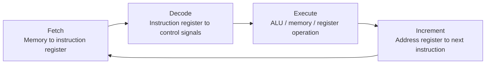

# CPU Operation

## Table of Contents

1. [Introduction](#1-introduction)
2. [Registers and Data Buses](#2-registers-and-data-buses)
3. [Memory Access](#3-memory-access)
4. [Load Instructions](#4-load-instructions)
5. [Store Instructions](#5-store-instructions)
6. [Instruction Decoding](#6-instruction-decoding)
7. [Instruction Set and Implementation](#7-instruction-set-and-implementation)
8. [Arithmetic Operations](#8-arithmetic-operations)
9. [The Control Unit](#9-the-control-unit)
10. [Instruction Execution Cycle](#10-instruction-execution-cycle)
11. [Real Instruction Set Architectures](#11-real-instruction-set-architectures)
12. [Summary](#12-summary)

## 1. Introduction

This document describes the operation of a central processing unit (CPU). The document covers registers, data buses, memory access, instruction decoding, arithmetic operations, and the instruction execution cycle. This document does not cover clock signals or complex control flow.

## 2. Registers and Data Buses

A register is a set of memory cells called latches. The latches are made of logic gates and interconnected to retain information. Each latch in the register has an output wire. The output wire reads the value held in the latch.

Registers have input wires and a write enable wire. The write enable wire overwrites the values in the latches. When the write enable signal is off, the stored values do not change regardless of the input values. Activating the write enable signal overwrites the values in the latches. After the values are set, the inputs can be deactivated and the new values remain stored.

A latch can be modified so that the same wires serve as both inputs and outputs. A read enable signal activates the wires as outputs. The stored information is read through the outputs. A write enable signal activates the wires as inputs. The information in the register is overwritten through the inputs. This approach reduces the number of wires required for multiple registers.

The data lines of multiple registers are combined into a single general data bus. When the data bus is used as an input, the input value reaches each register. Each register has its own write enable signal. The write enable signal of the specific register to modify is activated.

The same principle applies to reading. Activating the read enable signal for the register to read from causes the general data bus to act as an output. The correct write or read enable input selects the register to read from or write to using a single data bus.

A binary decoder selects between multiple options electronically.

## 3. Memory Access

Memory is an array of bytes. Each byte is selected by inputting its position in the array through an address bus. A data bus alongside a read enable input reads the value stored in the selected byte. The same data bus can be used as an input alongside a write enable input to overwrite the value of the byte at the provided address.

## 4. Load Instructions

Program data resides in memory. To manipulate the data, the data is loaded into registers. A set of registers within the CPU is available for this purpose.

A load instruction copies the value stored in a specific memory location into the designated register. The current instruction indicates the register and the memory location.

The memory data bus connects to each register. To copy data from memory to a register, the memory address where the data resides is read. The address bus and the read enable signal of the memory are activated. The memory data bus outputs the value stored at the provided address. The value serves as input to every register.

The value is copied only into the designated register. The write enable signal is activated only for that specific register. The register overwrites its current value with the data read from memory.

## 5. Store Instructions

A store instruction performs the opposite action of a load instruction. The instruction directs the computer to store the current value held in a register into a memory location.

The value is read from the register. The respective read enable input is activated. The value stored in that register becomes the input on the memory data bus. The memory address where the value is stored is specified. The memory write enable signal is activated. The value from the register is copied to memory.

## 6. Instruction Decoding

The signals necessary to control the components originate from the instructions. Binary decoders are used for this task. The inputs for the decoders originate from the instructions.

Assembly Language serves as a human-readable representation of code. An assembler translates the human-readable code into binary machine code. The sequence of bits contains the information to instruct the computer.

If the first two bits are $0$ $0$, the computer interprets the instruction as an arithmetic operation. The third and fourth bits specify the type of operation.

If the first two bits are not $0$ $0$, the instruction signifies something other than an arithmetic operation. The instruction is a load instruction if the first bits are $0$ $1$. The instruction is a store instruction if the first bits are $1$ $0$.

For load or store instructions, the third and fourth bits indicate which register to read from or write to. The last four bits represent the memory address.

A binary decoder distinguishes between different kinds of instructions. The third and fourth bits of the instruction serve as inputs for the decoders. The decoders activate the enable signals of the desired register.

In this configuration, both the read and write enable signals of the register are activated simultaneously. Only one of them is activated depending on the instruction. A decoder differentiates between different instruction types. The outputs of that decoder ensure that only the desired input is activated according to the instruction. A specific register is selected and either its write or its read enable signal is activated.

If the two bits are not meant to interact with any register, the setup prevents any signal from reaching the registers. The stored values remain safe.

The last four bits of the instruction represent the memory address to read from in the case of a load instruction. The bits serve as input to the address bus. To copy the value of the selected address to the selected register, the memory read enable signal is activated. The data bus outputs the value and sends it to the registers. Only the write enable signal of the designated register is active. Only that register overwrites its content with the received value.

For a store instruction, the decoder activates only the read enable signal of the register specified in the third and fourth bits of the instruction. The value of that register acts as an input on the memory data bus. The same wire that activated the memory read enable signal in the load instruction deactivates it. The last four bits of the instruction indicate where to write the value being input into the data bus. The write enable signal of the memory is activated. The input to the corresponding output of the instruction decoder is connected. The value in the register is copied to the memory location.

## 7. Instruction Set and Implementation

Both load and store instructions use the third and fourth bits to indicate the register to write to or read from. A single decoder achieves the same result.

An **instruction-set architecture (ISA)** defines the instructions, operands, registers, data types, and observable effects available to software. A processor implementation can use different internal circuits while preserving the same ISA. Such implementations can execute the same machine code even when their pipelines, caches, buses, and control logic differ.

The internal design that implements an ISA is commonly called the **microarchitecture**. Microarchitectures can use different datapaths and control circuits to produce the same architectural result. Software compatibility therefore depends on the ISA and the operating-system binary interface, not on identical internal wiring.

Two similar architectures differ only in the interconnections of the instruction register outputs. The change causes both architectures to perform different actions. In the first architecture, the sequence of bits in the instruction register means store the current value of register $2$ in memory location $15$. In the second architecture, the same sequence of bits means load into register $1$ the value stored in memory location $15$. The architectures are incompatible.

An executable compiled for one instruction-set architecture does not natively execute on an incompatible instruction-set architecture. The executable contains instructions encoded for its target architecture. Translation, emulation, or a compatibility layer can provide execution on another architecture.

## 8. Arithmetic Operations

The first two bits being $0$ $0$ indicate an arithmetic operation. The arithmetic logic unit (ALU) performs the operation. If the instruction is an arithmetic operation, the third and fourth bits specify the type of operation. The two bits serve as the opcode input for the ALU.

The ALU requires two values to operate. Two registers are read simultaneously. Accessing each register data line directly requires internal logic to bypass the general data bus. The fifth and sixth bits of the instruction determine the first operand. The seventh and eighth bits determine the second operand.

The registers are not connected directly to the ALU because the inputs could be any of the registers. Selection circuitry chooses which register values reach the ALU inputs. A multiplexer can implement this selection, but its internal circuit is an implementation detail.

Two multiplexers are used, one for each input of the ALU. The inputs of the multiplexers are the individual data buses of each register. The output of the instruction decoder identifies arithmetic operations. The output toggles the read enable signal of all the registers. The registers output their values through their respective data buses to serve as inputs to the multiplexers.

Each multiplexer is instructed on which register values to pass to the ALU. The ALU outputs the difference between the input values for a subtraction operation. For example, subtracting $53$ from $205$ produces $152$.

The result of the operation is stored. In many architectures, the result is stored in one of the registers that contained the operands. In this architecture, the result of any operation is stored in the register that contained the first operand. The register cannot be written to directly while reading from it. The result is temporarily saved in a register. The registers are connected and set so the value is written to the target register.

## 9. The Control Unit

The control unit reads each instruction of the demonstration CPU and generates the control signals required to execute that instruction.

Special registers exist inside the control unit, such as the instruction register and the address register. Small one-bit registers called flags are also present. All of these components are packed inside another component known as the central processing unit (CPU).

The demonstration CPU defines an initial register state for its startup sequence. Real processors have architecture-specific reset states. Both data and instructions are fetched from an external source called memory. The registers inside the control unit each have a specific purpose. The purpose of the instruction register is to hold the instruction. The purpose of the address register is to point to the memory location of the next instruction the CPU will execute. The demonstration CPU initializes this location to zero.

To load the instruction into the instruction register, the control unit activates the memory read enable input. The memory outputs the value stored at the provided address. The value is sent to multiple registers. The control unit activates the write enable input of the instruction register. The process of bringing instructions from memory to the CPU is known as the fetch stage.

The decode stage follows. The outputs of the instruction register are inputs for all the internal components of the control unit. The internal circuitry reads and interprets the bit sequence in the instruction register. The necessary signals are sent to all components needed to execute that specific instruction.

The CPU executes the instruction once everything is set up. The execution copies the value from a memory location to a register. This is known as the execute stage. The CPU has run the first instruction of the program.

After executing the instruction, the internal circuitry of the control unit increments the value of the address register. The value is increased by one because each instruction is one byte long. Modern architectures have thousands of possible instructions. Instructions are larger and the increment value can vary. The increment operation ensures that when the CPU goes back to the fetch step, the address register points to the next instruction of the program.

The cycle repeats. The instruction is loaded into the instruction register, decoded, and then executed. The address register is incremented, pointing to the third instruction.

During the following fetch stage, the instruction is an arithmetic operation. The operation is an addition between the values in two registers loaded in the previous two instructions. The control unit activates the read enable signal of both registers. Internal multiplexers direct both values to the ALU inputs. The ALU receives the opcode for the addition operation. The ALU outputs the result of adding the two numbers. The result is temporarily stored in an internal register. The control unit resets and sets the signals needed to store the value in the specified general purpose register.

After executing the instruction, the address register is incremented and the cycle repeats. The control unit sets everything to copy the value from the register where the result of the addition is held to a memory location.

## 10. Instruction Execution Cycle

The instruction execution cycle consists of the following stages:

1. Fetch: The control unit activates the memory read enable input. The memory outputs the value stored at the address in the address register. The control unit activates the write enable input of the instruction register. The instruction is loaded into the instruction register.

2. Decode: The outputs of the instruction register are inputs for the internal components of the control unit. The internal circuitry reads and interprets the bit sequence. The necessary signals are sent to the components needed to execute the instruction.

3. Execute: The CPU executes the instruction. The operation is performed on the data.

4. Increment: The internal circuitry of the control unit increments the value of the address register. The address register points to the next instruction of the program.

The cycle repeats.

## 11. Real Instruction Set Architectures

The load, store, and arithmetic instructions in this document belong to an instruction set built for demonstration. Production instruction-set architectures define comparable operations with different encodings, register counts, and addressing modes. The table below compares the demonstration instructions with their approximate equivalents in two production architectures.

| Operation | Demonstration ISA | x86-64 (Intel syntax) | ARM64 (AArch64) |
| :--- | :--- | :--- | :--- |
| Load from memory | `LOAD reg, [addr]` | `mov rax, [rbx]` | `ldr x0, [x1]` |
| Store to memory | `STORE reg, [addr]` | `mov [rbx], rax` | `str x0, [x1]` |
| Add two registers | `ADD reg1, reg2` | `add rax, rbx` | `add x0, x0, x1` |
| Increment a register | `INC reg` | `inc rax` or `add rax, 1` | `add x0, x0, #1` |

Both x86-64 and ARM64 implement the fetch-decode-execute cycle described in this document, but their microarchitectures use techniques not covered here, including pipelining, superscalar issue, and out-of-order execution, to execute multiple instructions per clock cycle.

### 11.1 References

- Intel Corporation, [Intel 64 and IA-32 Architectures Software Developer's Manuals](https://www.intel.com/content/www/us/en/developer/articles/technical/intel-sdm.html), the authoritative reference for x86-64 instruction encoding, registers, and execution behavior.
- Arm Limited, [Arm Architecture Reference Manual for A-profile Architecture](https://developer.arm.com/documentation/ddi0487/latest/), the authoritative reference for the ARM64 (AArch64) instruction set.
- RISC-V International, [The RISC-V Instruction Set Manual](https://riscv.org/technical/specifications/), a freely available specification for an open instruction-set architecture, useful for comparing a minimal modern ISA against the demonstration ISA in this document.

## 12. Summary

This document describes the operation of a CPU. The document covers registers, data buses, memory access, load instructions, store instructions, instruction decoding, architecture design, arithmetic operations, the control unit, the instruction execution cycle, and a comparison with real instruction set architectures. This document does not cover clock signals or complex control flow.
