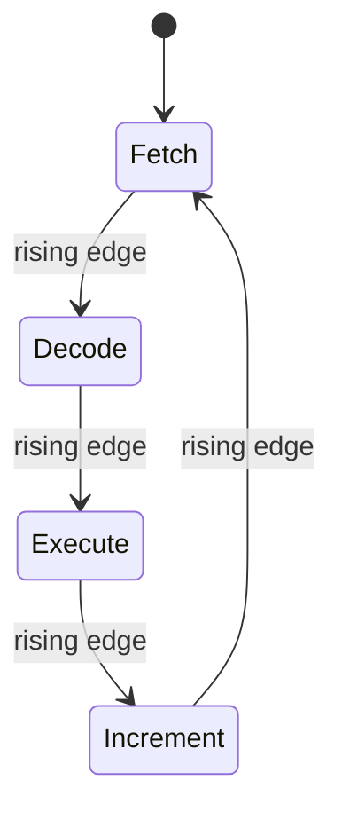

# Clock Signals and Processor Step Sequencing

## Table of Contents

1. [Introduction](#1-introduction)
2. [Clock Signal Characteristics](#2-clock-signal-characteristics)
3. [Edge Detection](#3-edge-detection)
4. [Latches](#4-latches)
5. [Flip-Flops](#5-flip-flops)
6. [Binary Counters](#6-binary-counters)
7. [Processor Stage Sequencing](#7-processor-stage-sequencing)
8. [References](#8-references)
9. [Summary](#9-summary)

## 1. Introduction

This document describes the role of the clock signal in processor instruction execution. The document covers clock signal characteristics, edge detection circuits, latches, flip-flops, binary counters, and the sequencing of processor stages. This document does not cover clock implementation or the physical construction of flip-flops.

## 2. Clock Signal Characteristics

A computer executes instructions one by one. Each instruction requires several steps: fetch, decode, and execute. A clock orchestrates the step-by-step progression through each instruction.

A clock produces an oscillating signal. The signal operates in concert with logic gates.

A clock signal is a series of pulses. Clocks generate multiple waveform types. Square waves are the focus because they take only two values. The two values match the binary nature of computers.

The edges of the clock signal are the portions where the signal switches from one value to another. A rising edge occurs when the clock signal changes from $0$ to $1$. A falling edge occurs when the clock signal changes from $1$ to $0$.

During a stable clock level, a level-sensitive circuit can respond to its inputs. An edge-triggered circuit responds to the specified clock transition instead. The stable interval is therefore not a universal period during which the processor does not react.

## 3. Edge Detection

An edge detector is a circuit that detects signal transitions. A rising edge detector produces a pulse at every rising edge of the clock signal.

The edge detector circuit contains an AND gate and an inverter. Both inputs of the AND gate originate from the same source. One input is negated.

The operation of the edge detector is as follows:

1. The input is the clock signal.
2. When the input value is $0$, the circuit is stable.
3. When the input flips to $1$, the signal propagates to the left.
4. The inverted signal takes a longer time to update.
5. The AND gate receives a $1$ at both inputs for a brief moment.
6. The AND gate outputs a $1$.
7. The updated output of the inverter reaches the AND gate.
8. The output of the AND gate returns to $0$.

The inverter introduces a propagation delay determined by the circuit implementation. The delay produces a pulse at each rising edge in this conceptual edge-detector circuit.

## 4. Latches

A latch is a circuit that stores a $1$ or a $0$.

### 4.1 SR Latch

An SR latch is made of two NOR gates. The SR latch stands for set-reset latch.

| Terminal | Function |
| :------: | :------- |
| S | Sets the stored value |
| R | Resets the stored value |
| Q | Outputs the stored value |
| Q̄ | Outputs the inverse of the stored value |

The operation of the SR latch is as follows:

1. Activating the S input causes Q to output $1$.
2. The value is held when the S input returns to $0$.
3. The R input resets the value of Q to $0$.
4. When both inputs are $0$, the circuit remembers the last value.

Setting both inputs to $1$ is invalid. The circuit attempts to set and reset the output at the same time. Both Q and Q̄ output $0$, which is invalid because they are always opposites. When both inputs return to $0$, the circuit holds either a $1$ or a $0$. The held value depends on which input changes first. This condition creates uncertainty.

### 4.2 Gated SR Latch

A gated SR latch includes an additional input called enable.

| Enable | Effect |
| :----: | :----- |
| $0$ | The S and R inputs have no effect |
| $1$ | The S and R inputs set or reset the latch |

The latch is modified only when the enable signal is active.

### 4.3 Level Triggering

When the clock drives the enable signal, the signal level determines whether the latch can be modified. The latch is level triggered.

## 5. Flip-Flops

A flip-flop is edge triggered. An edge detector is placed between the clock and the latch. The signal level does not determine the trigger. The rising edge of the clock triggers the latch operation. The brief moment when the edge detector outputs $1$ triggers the operation.

A latch is level triggered. A flip-flop is edge triggered. Both store a bit of information.

### 5.1 JK Flip-Flop

The JK flip-flop eliminates the invalid state of the SR latch.

The JK flip-flop operates as follows:

| J | K | Rising Edge Effect |
| :-: | :-: | :----------------- |
| $1$ | $0$ | Set |
| $0$ | $1$ | Reset |
| $1$ | $1$ | Toggle |
| $0$ | $0$ | No change |

The values of Q and Q̄ are always opposites. The internal set and reset signals are never active at the same time.

When both J and K are activated during a rising edge, the flip-flop toggles the stored value. If the stored value is $1$, the K input resets the latch. If the stored value is $0$, the J input sets the latch.

### 5.2 Toggle Configuration

J and K are permanently set to $1$. The inputs are held at the logic level representing $1$. The voltage corresponding to a logic level depends on the implementation. The clock oscillation causes the value to toggle automatically. A new signal is created at output Q. The new signal alternates between two states.

The toggle occurs only on the rising edges of the original clock. The resulting signal oscillates at half the frequency of the original clock signal.

## 6. Binary Counters

A chain of flip-flops produces a division of the clock frequency.

| Flip-Flop | Output Frequency |
| :-------: | :--------------- |
| First | One half of the clock frequency |
| Second | One quarter of the clock frequency |
| Third | One eighth of the clock frequency |
| $n$th | One $2^n$th of the clock frequency |

Each additional flip-flop makes the signal oscillate twice as slowly as the previous flip-flop.

The content of four flip-flops is a 4-bit number. Every clock rising edge causes the number to increment by one. When the maximum value of a 4-bit number is reached, the next rising edge returns the number to zero. The number begins incrementing again.

The circuit is abstracted into a single component called a binary counter. The clock is not part of the component. A push button replaces the clock to control when the rising edges occur. The stored value increments only when the button is pressed.

## 7. Processor Stage Sequencing

Each instruction requires four stages:

1. Fetch
2. Decode
3. Execute
4. Increment the program counter

The CPU activates only the circuits for the current stage. Circuits for inactive stages are deactivated.

### 7.1 Fetch Stage

The CPU activates the following wires during the fetch stage:

- The address register read enable input
- The memory read enable input
- The instruction register write enable input

The address register sends its value to the memory address input. The memory outputs the content at the provided address. The instruction register overwrites its content with the data from memory.

### 7.2 Decode Stage

The wires used in the fetch stage are deactivated. The instruction register read enable input is activated. The contents of the instruction register flow to the decoding circuitry.

### 7.3 Stage Selection

A binary decoder selects between multiple options. The decoder activates one output corresponding to the binary input value.

A binary counter increments the decoder input. The CPU performs the stages sequentially.

### 7.4 Counter Configuration

Four stages require a 2-bit binary number as input. A binary counter made from two JK flip-flops provides the 2-bit number. The binary counter connects to a clock. The computer progresses to the next stage on every rising edge.

## 8. References

- Texas Instruments, [SN74LS74A Dual D-Type Positive-Edge-Triggered Flip-Flop datasheet](https://www.ti.com/lit/ds/symlink/sn74ls74a.pdf), a manufactured edge-triggered flip-flop with published timing characteristics, including setup time, hold time, and propagation delay, which this document does not quantify.
- Institute of Electrical and Electronics Engineers, [IEEE Xplore Digital Library](https://ieeexplore.ieee.org/), for peer-reviewed literature on clock distribution, clock skew, and synchronous digital design.

## 9. Summary

This document describes the role of the clock signal in processor instruction execution. The document covers clock signal characteristics, edge detection, latches, flip-flops, binary counters, and processor stage sequencing. This document does not cover clock implementation, the physical construction of flip-flops, or memory.
