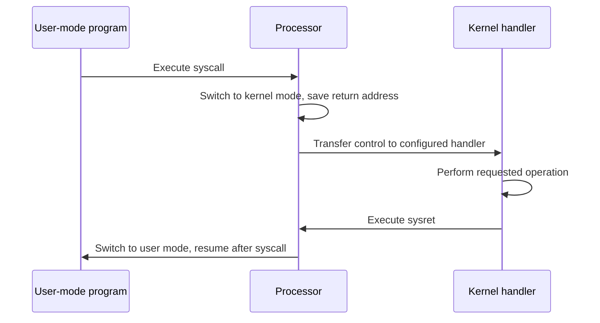

# Operating System Boundaries

## Table of Contents

1. [Introduction](#1-introduction)
2. [Processor Modes](#2-processor-modes)
3. [Interrupts](#3-interrupts)
4. [System Calls](#4-system-calls)
5. [Device I/O](#5-device-io)
6. [Preemption](#6-preemption)
7. [Kernel-Mode Drivers](#7-kernel-mode-drivers)
8. [Real System-Call Instructions](#8-real-system-call-instructions)
9. [Summary](#9-summary)

## 1. Introduction

This document describes how processor modes separate user programs from operating-system operations. The document covers privileged instructions, interrupts, system calls, device I/O, timer-based preemption, and kernel-mode drivers. The document does not cover detailed interrupt-controller design or operating-system scheduling algorithms.

## 2. Processor Modes

A processor can use operational modes to restrict which instructions execute. In **user mode**, a program can perform operations such as arithmetic, data movement, and control flow. It cannot execute privileged instructions that directly control protected hardware resources.

In **kernel mode**, operating-system code can execute privileged instructions. These instructions can control input/output devices, configure the memory management unit (MMU), and configure interrupt handling.

Processor hardware tracks the current mode. User programs cannot directly change their own mode to kernel mode. Interrupt mechanisms provide controlled transitions into operating-system code.

## 3. Interrupts

An **interrupt** signals that an event requires processor attention. Hardware events, such as keyboard input, can trigger interrupts. Software can also request an interrupt to enter an operating-system service routine.

When an interrupt occurs, the processor transfers control to a configured handler. The handler preserves the interrupted execution state, handles the event, restores the state, and returns to the interrupted program. The operating system configures the handler locations and uses memory protection to prevent user programs from replacing them.

An interrupt can cause the processor to enter kernel mode. The hardware and operating system control this transition so that user code cannot select an arbitrary privileged handler.

## 4. System Calls

A **system call** requests an operating-system service. File operations provide an example: a program can request that the operating system open, read, write, or close a file.

A system-call interface can use a software interrupt or an architecture-specific instruction. The processor transfers control to an operating-system handler in kernel mode. The handler performs permitted operations and returns control to the program in user mode. Some processor architectures provide dedicated instructions for system-call entry and return.

System calls provide hardware abstraction. Programs request services without directly controlling device hardware. This boundary also limits the damage that user-mode code can cause through incorrect device operations. Common interfaces can improve source-code portability, while differences between operating systems can make system-call interfaces platform dependent.

Entering and returning from the operating system adds execution overhead. A system call does not necessarily switch execution to a different process. The operating system may perform other work, such as scheduling, before returning to the caller.

## 5. Device I/O

A device controller manages the hardware-specific operation of a device. The controller exposes registers for commands, status, and data. The processor communicates with the controller over an interconnect rather than controlling each device action directly.

With **programmed I/O**, the operating system repeatedly reads a status register until the controller reports that it is ready. Polling consumes processor time while the device is not ready. With interrupt-driven I/O, the controller raises an interrupt when an event requires service, and the operating system runs the associated handler.

**Memory-mapped I/O** assigns address ranges to device registers. A processor can then use load and store instructions to access those registers, while address-decoding hardware routes the operation to main memory or the selected device controller. The operating system controls which code can access these regions.

## 6. Preemption

A cooperative operating system depends on programs to return control, for example by making a system call. A program that does not return control can prevent other processes from running.

A timer can trigger a hardware interrupt after a configured interval. The operating system configures the timer before allowing a user process to run. When the timer interrupt occurs, the processor transfers control to the operating system, which can suspend the current process and schedule another one. User-mode code cannot disable this mechanism by executing a privileged instruction.

## 7. Kernel-Mode Drivers

A **device driver** contains code that controls a hardware device. Operating systems can use drivers supplied by hardware manufacturers when built-in operating-system code does not support a device.

Drivers that execute privileged instructions must run in kernel mode. Kernel-mode code has access to resources that user-mode code cannot directly control. A driver defect can corrupt operating-system data or cause a system failure. The effect depends on the operating system's driver isolation and protection mechanisms.

Some security software also uses kernel-mode components to inspect hardware activity or process memory. This access can support monitoring that is unavailable to user-mode software, but it also gives the component access to protected system resources.

## 8. Real System-Call Instructions

Section 4 describes the system-call boundary in general terms. Production processor architectures provide a dedicated instruction for entering the operating system, distinct from the general interrupt mechanism described in Section 3.

| Architecture | System-Call Entry Instruction | Return Instruction |
| :--- | :--- | :--- |
| x86-64 | `syscall` | `sysret` |
| x86 (32-bit, legacy) | `int 0x80` (software interrupt) or `sysenter` | `iret` or `sysexit` |
| ARM64 (AArch64) | `svc` (supervisor call) | `eret` |

The `syscall` instruction on x86-64 switches the processor to kernel mode, sets the program counter to a kernel-configured handler address stored in a model-specific register, and saves the user-mode return address and flags in designated registers rather than on the interrupt stack used by hardware interrupts. This is faster than the legacy `int 0x80` software-interrupt mechanism, which goes through the general interrupt-descriptor-table dispatch described in Section 3. [Application Binary Interface](09-application-binary-interface.md), Section 6, describes the Linux x86-64 register convention used to pass the system-call number and arguments across this boundary.

### 8.1 References

- Intel Corporation, [Intel 64 and IA-32 Architectures Software Developer's Manuals](https://www.intel.com/content/www/us/en/developer/articles/technical/intel-sdm.html), for the `syscall`/`sysret` and `sysenter`/`sysexit` instruction pairs.
- Arm Limited, [Arm Architecture Reference Manual for A-profile Architecture](https://developer.arm.com/documentation/ddi0487/latest/), for the `svc` and `eret` instructions and ARM exception levels.
- The Open Group, [POSIX.1-2017 (IEEE Std 1003.1-2017)](https://pubs.opengroup.org/onlinepubs/9699919799/), for the standard system-call interfaces referenced throughout this manual series.

## 9. Summary

This document describes processor modes, interrupts, system calls, device I/O, preemption, kernel-mode drivers, and the real system-call instructions used by x86-64 and ARM64 processors. Processor modes and operating-system handlers restrict access to privileged operations. The document does not cover detailed interrupt-controller design or operating-system scheduling algorithms.
