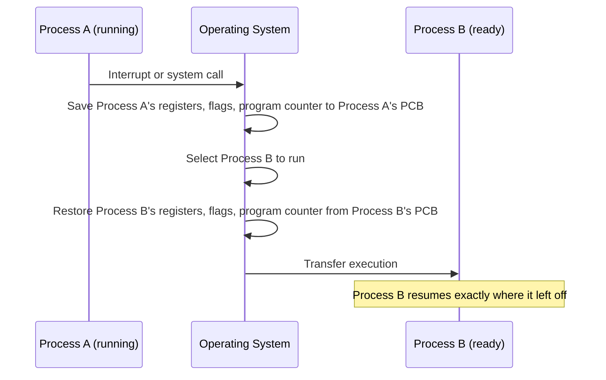

# Process Context and Context Switching

## Table of Contents

1. [Introduction](#1-introduction)
2. [Process Address Space](#2-process-address-space)
3. [CPU State](#3-cpu-state)
4. [Context Switching](#4-context-switching)
5. [Process Control Blocks](#5-process-control-blocks)
6. [A Typical Address Space Layout](#6-a-typical-address-space-layout)
7. [Summary](#7-summary)

## 1. Introduction

This document describes process context and context switching. The document covers process address spaces, CPU state, state preservation, and process control blocks. The document does not cover CPU scheduling algorithms or detailed process management.

## 2. Process Address Space

A process has an **address space** containing the memory assigned to that process. The operating system allocates memory for executable code, data, user input, and temporary results.

Processes require memory isolation. Without memory protection, one process could read or modify another process's memory. The operating system tracks process memory so that access to memory outside a process's permitted address space can be prevented.

## 3. CPU State

The CPU state of a process consists of the values required to resume its execution. This state includes the program counter, general-purpose registers, instruction register, and flags. Depending on the processor, the state can also include a stack pointer, index registers, and accumulators.

Consider two processes that each execute two load instructions followed by an addition. The first process loads $12$ and $20$ into registers. The second process loads $100$ and $35$ into the same registers. If execution switches between the processes without saving and restoring CPU state, the first process can add the second process's values and produce $135$ instead of $32$. The second process can then use the first process's result and produce $170$ instead of $135$.

The program counter must also be preserved. Without its previous value, a process cannot resume at the instruction following the point where it was interrupted.

## 4. Context Switching

A **context switch** saves the CPU state of one process and restores the CPU state of another process. The operating system saves the interrupted process's registers, flags, and program counter in memory. The operating system then restores the saved state of the process selected to run.

Saving and restoring CPU state preserves execution correctness. Restoring a process's state prevents the CPU state left by another process from replacing its register values or program counter.

CPU-state preservation does not replace memory protection. The operating system must also enforce address-space boundaries so that one process cannot access another process's protected memory.

On a single processor core, only one process executes at a time. The operating system can alternate CPU access between processes. A multi-core system can execute multiple process contexts at the same time, with each core providing an execution context.

## 5. Process Control Blocks

A **Process Control Block (PCB)** is an operating-system data structure that represents a process. A PCB is not the process itself. The operating system uses the PCB to store information required to start or resume the process and to track its resources.

A PCB can contain the following information:

- A process identifier and process state
- The program counter, general-purpose registers, instruction register, and flags
- Memory-management information for the process address space
- References to allocated input/output devices and open files
- A reference to the parent process and references to child processes
- Accounting information

The exact fields depend on the operating system. In Linux, a task structure represents a schedulable task. Threads and processes use this representation for scheduling.

The operating system places process representations in data structures used to manage execution. A process queue contains references to these representations rather than the process as a standalone object.

## 6. A Typical Address Space Layout

The address space introduced in Section 2 is commonly organized into contiguous regions. The table below shows an approximate layout for a process on a 64-bit Linux system. Exact addresses vary by kernel version, configuration, and whether address-space layout randomization (ASLR) is enabled.

| Region | Approximate Location | Contents |
| :--- | :--- | :--- |
| Kernel space | Top of the 64-bit address range | Mapped in every process, accessible only in kernel mode |
| Stack | High user-space addresses, growing downward | Function-call frames, described in [The Call Stack](10-the-call-stack.md) |
| Memory-mapped region | Below the stack | Shared libraries, memory-mapped files |
| Heap | Above the data segment, growing upward | Dynamically allocated memory, described in [Heap Allocation](11-heap-allocation.md) |
| Data segment (BSS and initialized data) | Above the text segment | Global and static variables |
| Text segment | Low user-space addresses | Executable code |
| Unmapped (NULL) page | Address `0` | Reserved; a dereferenced null pointer faults here |

This layout is a convention, not a hardware requirement. [Memory Protection](16-memory-protection.md) describes the hardware mechanisms that restrict a process to its assigned address space, and [Operating System Boundaries](13-operating-system-boundaries.md) describes the kernel-space and user-space boundary referenced in this table.

## 7. Summary

This document describes process address spaces, CPU state, context switches, process control blocks, and a typical 64-bit process address-space layout. The operating system saves and restores CPU state to resume execution and enforces memory protection to isolate process address spaces. The document does not cover CPU scheduling algorithms or detailed process management.
