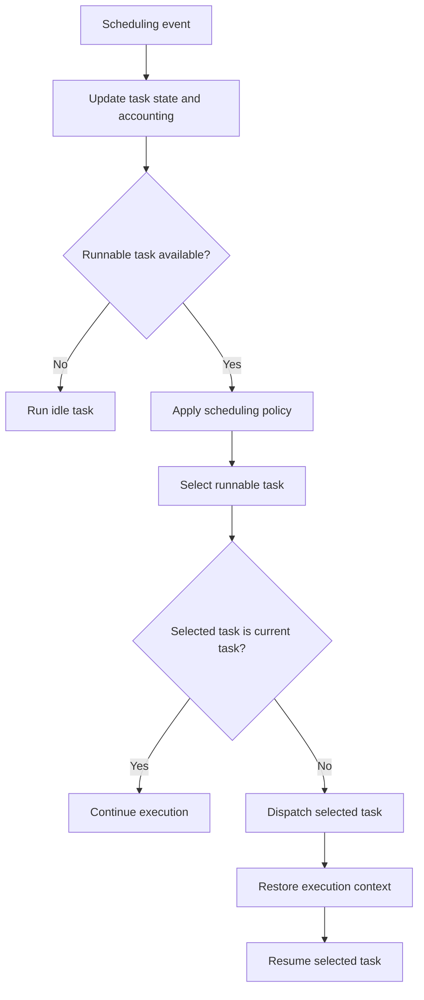

# CPU Scheduling

## Table of Contents

1. [Introduction](#1-introduction)
2. [CPU Bursts and Process States](#2-cpu-bursts-and-process-states)
3. [Scheduling Responsibilities](#3-scheduling-responsibilities)
4. [Scheduling Criteria](#4-scheduling-criteria)
5. [Scheduling Algorithms](#5-scheduling-algorithms)
6. [Multilevel Scheduling](#6-multilevel-scheduling)
7. [Scheduling Decision Model](#7-scheduling-decision-model)
8. [Architecture and Implementation Notes](#8-architecture-and-implementation-notes)
9. [Summary](#9-summary)

## 1. Introduction

This document describes how an operating system selects tasks to run on a processor. The document covers CPU bursts, process states, scheduling criteria, and common scheduling algorithms. The document does not cover the scheduling policies of specific operating systems.

## 2. CPU Bursts and Process States

A process alternates between **CPU bursts** and **input/output (I/O) bursts**. A CPU burst is a period when the process executes instructions. An I/O burst is a period when the process waits for an input/output operation or event. A process can use the CPU again after the wait ends.

Processes are commonly described with the following states:

- **New:** The process is being created and loaded.
- **Ready:** The process can execute but is waiting for CPU time.
- **Running:** The process is executing on a processor core.
- **Waiting:** The process is waiting for an input/output operation or event.
- **Terminated:** The process has finished execution.

Operating systems can use different state names or divide these states into more detailed states. On one processor core, only one task can execute at a time. Other runnable tasks wait for CPU time.

A timed sleep places a running task in the waiting state until its wake time. The operating system records the wake time and can use a timer interrupt to check sleeping tasks. When a task's wake time has expired, the operating system moves it to the ready state. The task does not necessarily run immediately because other ready tasks can be selected first.

## 3. Scheduling Responsibilities

A **scheduler** selects a runnable task from the ready queue according to a scheduling policy. A queue contains references to operating-system records for tasks rather than process objects themselves. Modern operating systems commonly schedule threads as the runnable tasks.

A **dispatcher** carries out the scheduler's decision. It saves the current execution state when necessary, restores the selected task's state, and transfers CPU execution to that task. The state can include registers and the program counter.

When a running task requests I/O, it enters the waiting state. The operating system can dispatch another ready task while the first task waits. When the I/O operation completes, the waiting task returns to the ready state; it does not necessarily run immediately.

## 4. Scheduling Criteria

Scheduling policies can be evaluated using several criteria:

- **CPU utilization:** The fraction of time the processor performs work.
- **Throughput:** The number of tasks completed per unit of time.
- **Turnaround time:** The time from a task's submission to its completion, including ready-queue wait, CPU execution, and I/O wait.
- **Waiting time:** The total time a task spends in the ready queue.
- **Response time:** The time from a request's submission to its first response.

Interactive systems often prioritize response time. Other systems can prioritize throughput, turnaround time, or processor utilization.

## 5. Scheduling Algorithms

### 5.1 First-Come, First-Served

**First-come, first-served (FCFS)** selects tasks in the order they enter the ready queue. A first-in, first-out queue implements this policy. FCFS is non-preemptive: a running task keeps the processor until it blocks, terminates, or otherwise yields it.

A task with a long CPU burst can delay tasks behind it. A task that waits for I/O releases the processor, allowing the scheduler to select another ready task.

### 5.2 Shortest-Job-First

**Shortest-job-first (SJF)** selects the ready task with the shortest predicted next CPU burst. If CPU-burst lengths are known, non-preemptive SJF minimizes average waiting time for a fixed set of tasks. In practice, the next burst must be estimated.

SJF can cause starvation. A task with a long predicted burst can wait indefinitely if shorter bursts continue to arrive. The preemptive form selects the task with the shortest remaining CPU burst and can interrupt the running task when a shorter one becomes ready.

### 5.3 Preemption

A **preemptive** policy can interrupt a running task and return it to the ready queue. A **non-preemptive** policy does not take the processor from a running task; the task must block, terminate, or yield it.

Preemptive scheduling requires a mechanism that returns control to the operating system. A timer interrupt can provide this mechanism by interrupting a task after a configured interval.

### 5.4 Round Robin

**Round-robin scheduling** uses a ready queue and a time quantum, also called a time slice. The scheduler dispatches the task at the head of the queue and starts a timer. If the task uses its full quantum, the timer interrupt causes preemption and the task returns to the tail of the ready queue. If the task blocks or finishes sooner, the scheduler selects another ready task.

For $n$ continuously ready tasks and a quantum of $q$, a task waits at most approximately $(n-1)q$ before its next turn under an idealized model. This estimate excludes context-switch overhead, newly arriving tasks, and higher-priority work.

A large quantum makes round robin approach FCFS. A small quantum increases context-switch overhead. The quantum must balance response time against time spent switching tasks.

### 5.5 Priority Scheduling

**Priority scheduling** selects a task according to its priority. Systems differ in how priority values are ordered. Round robin can be used among tasks with the same priority.

Priority scheduling can starve low-priority tasks when higher-priority tasks continue to arrive. **Aging** reduces this risk by increasing the priority of tasks that wait for a long time.

## 6. Multilevel Scheduling

### 6.1 Multilevel Queue

**Multilevel queue scheduling** separates tasks into queues, often by task type or response-time requirements. Each queue can use a different algorithm. For example, a foreground queue can use round robin while a background queue uses FCFS.

The scheduler must also choose among queues. Strict priority dispatches from the highest-priority nonempty queue and can starve lower-priority queues. Allocating CPU time among queues can improve fairness. Fixed queue assignment does not adapt when a task's behavior changes.

### 6.2 Multilevel Feedback Queue

**Multilevel feedback queue scheduling** allows tasks to move between priority queues based on their observed behavior. A task can start in a high-priority queue. A task that uses its full time quantum can move to a lower-priority queue. A task that blocks after a short CPU burst can remain at or return to a higher-priority queue.

This policy can favor interactive and I/O-bound tasks, which often use short CPU bursts, while tasks with long CPU bursts move to lower-priority queues. The exact promotion, demotion, and time-quantum rules vary by implementation. Aging or other policies can be used to prevent starvation.

## 7. Scheduling Decision Model

A scheduling decision can be represented as a sequence independent of any particular scheduling policy. The scheduler first determines which tasks are runnable, applies the policy to those tasks, and then dispatches the selected task. A task that is blocked, terminated, or otherwise not runnable is not a candidate for dispatch.

```text
function SCHEDULE(runnable_tasks, current_task):
    if runnable_tasks is empty:
        return IDLE

    candidate = SELECT_BY_POLICY(runnable_tasks, current_task)

    if candidate is invalid:
        return ERROR

    if candidate == current_task:
        return CONTINUE

    return DISPATCH(candidate)
```

The policy-specific selection step can implement FCFS, SJF, round robin, priority scheduling, or another policy. The `ERROR` case represents an invalid scheduler state rather than a normal scheduling outcome. A real operating system also maintains run queues, task state, accounting data, CPU affinity, and synchronization around scheduler data structures.

The scheduling path can be represented as follows:



A scheduling event can result from a task blocking, waking, yielding, terminating, or being preempted. A timer interrupt is one mechanism that can cause a preemptive scheduling decision, but a timer interrupt does not guarantee that the selected task will change.

## 8. Architecture and Implementation Notes

Scheduling policy is implemented by the operating system, but preemption depends on hardware mechanisms that return control to privileged software. The exact timer facility differs by architecture.

| Architecture | Timer mechanism relevant to scheduling | Interrupt state used by privileged software |
| :----------- | :------------------------------------- | :------------------------------------------ |
| x86-64 | Local APIC timer can generate a CPU-local timer interrupt | Interrupt delivery and architectural interrupt state are handled by the x86 interrupt mechanism |
| AArch64 | Arm Generic Timer can generate timer interrupts delivered through the interrupt controller | Timer and interrupt-controller state determines whether the interrupt is delivered |
| RISC-V | Supervisor timer interrupts can be generated from the timer facility; the exact mechanism can be supplied by the execution environment or by the `Sstc` extension | `sie.STIE`, `sip.STIP`, and `scause` participate in supervisor timer-interrupt handling |

The Linux kernel documentation describes a CPU-local APIC timer as a source of local interrupts on x86 systems. [Linux kernel x86 timekeeping documentation](https://docs.kernel.org/virt/kvm/x86/timekeeping.html) describes this mechanism. Arm documents the Generic Timer as an interrupt source handled through the GIC. [Arm Generic Timer guide](https://developer.arm.com/-/media/Arm%20Developer%20Community/PDF/Learn%20the%20Architecture/Generic%20Timer.pdf) describes this mechanism. The RISC-V privileged architecture defines supervisor timer interrupts and the `STIP`/`STIE` state, and the `Sstc` extension adds the supervisor `stimecmp` register. [RISC-V supervisor-level architecture](https://docs.riscv.org/reference/isa/priv/supervisor.html) and [RISC-V Sstc extension](https://docs.riscv.org/reference/isa/v20250508/priv/sstc.html) define these mechanisms.

These mechanisms belong to the interrupt and context-switching layers rather than to a scheduling algorithm itself. The scheduler decides which runnable task should execute; the architecture provides mechanisms that allow privileged software to regain control and perform that decision.

### 8.1 Current Linux example

The algorithms in this chapter are scheduling models used to explain policy trade-offs. They should not be read as a description of the current Linux scheduler. Current [Linux scheduler documentation](https://kernel.org/doc/html/latest/scheduler/) describes EEVDF as replacing the earlier CFS approach in the fair scheduling path. [The EEVDF documentation](https://kernel.org/doc/html/latest/scheduler/sched-eevdf.html) describes selection using virtual deadlines and lag, while Linux also supports separate scheduling classes such as real-time policies.

Linux also exposes `SCHED_FIFO` and `SCHED_RR` real-time policies. [`sched(7)`](https://man7.org/linux/man-pages/man7/sched.7.html) specifies that `SCHED_RR` adds a time quantum to the FIFO model, while [`sched_setscheduler(2)`](https://man7.org/linux/man-pages/man2/sched_setscheduler.2.html) distinguishes these policies from the normal scheduling policy.

This distinction matters because an educational FCFS, SJF, or round-robin implementation defines a policy model. A production scheduler can combine priorities, fairness accounting, CPU topology, affinity, deadlines, and other constraints.

## 9. Summary

This document describes CPU scheduling using process states, CPU bursts, scheduling criteria, FCFS, SJF, round-robin, priority, multilevel queue, and multilevel feedback queue algorithms. The scheduling decision selects among runnable tasks; dispatch transfers execution to the selected task. Preemptive policies require a mechanism such as a timer interrupt to regain control of the processor. The algorithms presented here are policy models and are not descriptions of a particular operating system scheduler.
