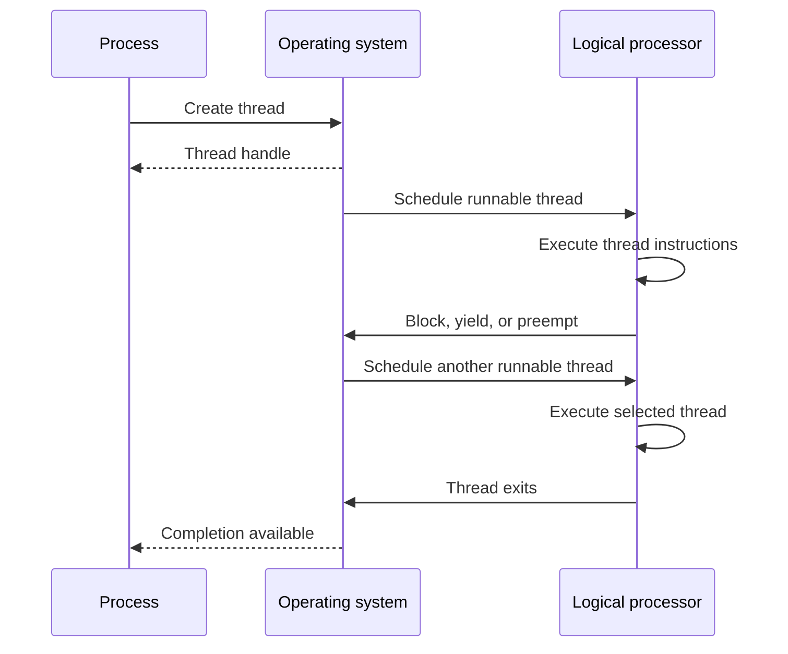

# Threads and Concurrency

## Table of Contents

1. [Introduction](#1-introduction)
2. [Concurrency and CPU Use](#2-concurrency-and-cpu-use)
3. [Processes and Threads](#3-processes-and-threads)
4. [Thread State and Memory](#4-thread-state-and-memory)
5. [Threaded Servers](#5-threaded-servers)
6. [Multicore Parallelism](#6-multicore-parallelism)
7. [Thread Lifetime](#7-thread-lifetime)
   1. [Thread Creation and Join](#71-thread-creation-and-join)
   2. [Python and the Global Interpreter Lock](#72-python-and-the-global-interpreter-lock)
   3. [Assembly Representation](#73-assembly-representation)
      1. [x86-64](#731-x86-64)
      2. [AArch64](#732-aarch64)
   4. [Architecture Data](#74-architecture-data)
   5. [Thread Execution Sequence](#75-thread-execution-sequence)
8. [Summary](#8-summary)

## 1. Introduction

This document describes threads, concurrency, and parallel execution. The document covers CPU use, process and thread state, shared memory, server request handling, multicore processors, and data and task parallelism. The document does not cover mutex algorithms, condition variables, lock-free algorithms, or parallel performance analysis in detail. Synchronization is introduced only where it is required to explain shared state and race conditions.

## 2. Concurrency and CPU Use

**Concurrency** allows multiple execution contexts to make progress over overlapping periods. On a single processor core, the operating system schedules execution by switching the core between runnable tasks. Rapid switching can make tasks appear to execute simultaneously.

A process can wait for an input/output operation and become unable to use the CPU. The operating system can schedule another runnable task while the first process waits. This can make better use of CPU time.

An application can use concurrent tasks for its interface, input handling, file uploads, and background checks. If one task waits for input/output, another task can continue to make progress.

## 3. Processes and Threads

A process contains an address space and resources such as open files. A process can contain one or more **threads**. A thread is an execution context within a process and is a schedulable unit. The operating system maintains scheduling state for each thread. On Linux, a thread is represented as a task and can share an address space with other threads in the same process.

A process with one thread has one active program counter. Multiple independently executing threads require separate program counters and register state. Threads provide separate execution contexts without requiring a separate process for each task.

Threads are not functions. A thread's program counter identifies the instruction it will execute. Multiple threads can execute the same function or other code in the process's text section.

## 4. Thread State and Memory

Each thread has its own program counter, register state, stack pointer, and thread-local execution state. The operating system saves and restores the state required to suspend one thread and resume another. The exact saved state is architecture- and kernel-dependent.

Threads in one process share the process address space and resources. Each thread has a separate stack for its local variables and function calls. A thread can address another thread's stack because the stacks normally reside in the same virtual address space. Such access does not become safe merely because the memory is addressable. Concurrent access to mutable stack data can require synchronization.

The heap is a common location for data shared between threads. Threads must synchronize access when one thread writes data that another thread reads or writes. Unsynchronized access can produce race conditions.

Processes retain separate address spaces by default. Threads in different processes do not share memory unless a separate interprocess communication mechanism provides it.

## 5. Threaded Servers

A server can create a separate process for each client request. This allows requests to progress concurrently, but each process has its own address space and requires operating-system resources. Process creation and interprocess communication can add overhead.

A server can instead create a thread for each request. Threads share the server process's address space and can access shared data without interprocess communication. Thread creation can require fewer resources than process creation, but shared data requires synchronization. A thread-per-request design can also become inefficient when the number of concurrent requests becomes large; bounded worker pools are a common alternative.

Concurrency can reduce the delay caused when one request waits for input/output. It does not guarantee that all tasks execute at the same instant. Parallel execution requires multiple processor cores or processors.

## 6. Multicore Parallelism

A processor package can contain multiple **cores**. Each core can execute a separate thread. A system with multiple cores can execute threads in parallel, while a single logical processor interleaves execution over time. Some processors expose multiple logical processors per core through simultaneous multithreading. Operating systems schedule software threads onto the available logical processors.

Concurrency means that multiple tasks make progress over overlapping periods. Parallelism means that multiple tasks execute at the same time. A system can provide concurrency without parallelism.

The number of simultaneously executing software threads is bounded by the number of logical processors available to the operating system. A system with $n$ logical processors can execute at most $n$ software threads simultaneously. A processor core can expose more than one logical processor through simultaneous multithreading, so the number of cores and the number of schedulable hardware contexts are not always equal.

Parallel execution does not guarantee a proportional reduction in elapsed time. Scheduling, synchronization, and shared hardware resources can limit performance.

### 6.1 Data Parallelism

**Data parallelism** divides a data set into subsets and applies the same operation to each subset on separate cores. For example, each core can check whether numbers in one part of an array are prime. The result for one number does not depend on the result for another number.

### 6.2 Task Parallelism

**Task parallelism** assigns different operations to separate threads. For example, separate threads can find the minimum and maximum values in an array, calculate its mean, and search for a specified value. These tasks can read the same data while performing different operations.

## 7. Thread Lifetime

A process starts with at least one thread, commonly called the **main thread**. Operating systems and thread libraries can allow additional threads to be created at runtime.

The effect of the initial thread terminating depends on the thread API and runtime. A process can remain alive while other threads execute, or a runtime can terminate the process when the initial thread exits. The behavior therefore must not be generalized from one thread library to all operating systems.

## 7.1 Thread Creation and Join

A thread API normally separates creation from completion. A creation operation establishes a new execution context, while a join operation waits for that context to terminate and can retrieve its result. The exact API is platform-specific. POSIX provides `pthread_create()` and `pthread_join()`. The Python `threading` module provides `Thread.start()` and `Thread.join()`. [POSIX `pthread_create()`](https://pubs.opengroup.org/onlinepubs/9799919799/functions/pthread_create.html) and [POSIX `pthread_join()`](https://pubs.opengroup.org/onlinepubs/9799919799/functions/pthread_join.html) define the corresponding POSIX operations.

A thread-creation operation can fail because the process or system cannot allocate the required resources. A join operation can fail when the target is invalid or when the API does not permit the requested relationship.

```text
function start_and_join(worker, argument):
    thread = create_thread(worker, argument)
    if thread == ERROR:
        return THREAD_CREATION_FAILED

    status = join_thread(thread)
    if status == ERROR:
        return THREAD_JOIN_FAILED

    return SUCCESS
```

## 7.2 Python and the Global Interpreter Lock

CPython historically used a global interpreter lock (GIL) to protect interpreter state. In a GIL-enabled build, only the thread holding the GIL can execute Python code that accesses Python objects through the Python C API. The GIL does not make arbitrary application data structures thread-safe, so Python programs can still require synchronization. Blocking I/O can release the GIL, allowing another thread to execute. [Python C API: Thread states and the global interpreter lock](https://docs.python.org/3.14/c-api/threads.html)

The GIL is an implementation property of CPython, not a requirement imposed by the Python language. CPython has supported free-threaded builds since Python 3.13. A free-threaded build can disable the GIL and allow Python threads to execute in parallel on multiple logical processors. The feature is not the default configuration, and extension modules can affect whether the GIL remains disabled. [Python: Free-threaded Python](https://docs.python.org/3.14/howto/free-threading-python.html)

This distinction matters when interpreting statements about Python threading. A statement that CPython threads cannot execute Python code in parallel is accurate for the default GIL-enabled configuration. It is not accurate as a universal statement about Python or all CPython builds.

## 7.3 Assembly Representation

Thread execution ultimately uses the same ISA instructions as other code. A context switch changes which saved register state the processor uses; it does not create a separate instruction set for threads. The following examples show ordinary stack and register operations used by thread entry or worker functions.

### 7.3.1 x86-64

```asm
worker:
    push    rbp
    mov     rbp, rsp
    add     rdi, 1
    mov     eax, edi
    pop     rbp
    ret
```

### 7.3.2 AArch64

```asm
worker:
    stp     x29, x30, [sp, #-16]!
    mov     x29, sp
    add     w0, w0, #1
    ldp     x29, x30, [sp], #16
    ret
```

These functions do not themselves create or schedule threads. They illustrate that a thread executes ordinary ISA instructions and maintains its own stack state. Thread creation and scheduling are supplied by the operating system and thread library.

## 7.4 Architecture Data

| Property | x86-64 | AArch64 | RISC-V |
| :--- | :--- | :--- | :--- |
| Program-counter register | `RIP` | `PC` | `pc` |
| General-purpose register count | 16 architectural GPRs | 31 general-purpose registers (`X0`–`X30`) | 32 integer registers (`x0`–`x31`) |
| Stack pointer | `RSP` | `SP` (`X31` encoding) | `x2` (`sp`) |
| Hardware simultaneous-execution model | SMT may expose multiple logical processors per core | Implementation-defined; Arm supports multithreading in some implementations | Implementation-defined |
| Thread execution state | OS-managed register and stack state | OS-managed register and stack state | OS-managed register and stack state |

The register descriptions are defined by the respective architecture specifications. [Intel 64 and IA-32 Architectures Software Developer's Manual](https://www.intel.com/content/www/us/en/developer/articles/technical/intel-sdm.html), [Arm Architecture Reference Manuals](https://developer.arm.com/documentation), and [RISC-V Unprivileged ISA Specification](https://docs.riscv.org/reference/isa/unpriv/) provide the architectural definitions. Linux also represents each schedulable thread as a task and provides scheduler interfaces for task state and scheduling. [Linux Scheduler Documentation](https://docs.kernel.org/scheduler/) describes the kernel-side model.

## 7.5 Thread Execution Sequence

The following sequence separates thread creation, scheduling, execution, blocking, and completion.



## 8. Summary

This document describes concurrency through threads within a process and parallel execution across multiple logical processors. Threads have separate execution state and stacks while sharing the process address space and selected process resources. The document covers data parallelism, task parallelism, task scheduling, input/output waits, server request handling, thread lifetime, thread creation and joining, and the CPython GIL as an implementation case study. The document does not cover mutex algorithms, condition variables, lock-free algorithms, or parallel performance analysis in detail.
