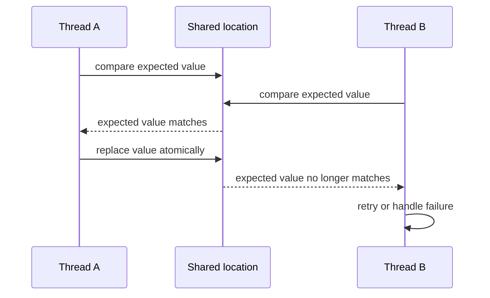

# Race Conditions

## Table of Contents

1. [Introduction](#1-introduction)
2. [Non-Atomic Operations](#2-non-atomic-operations)
3. [Concurrent Reads and Writes](#3-concurrent-reads-and-writes)
4. [Lost Updates](#4-lost-updates)
5. [Synchronization Requirements](#5-synchronization-requirements)
   1. [Naive Shared Flags](#51-naive-shared-flags)
   2. [Atomic Read-Modify-Write Operations](#52-atomic-read-modify-write-operations)
6. [Summary](#6-summary)

## 1. Introduction

This document describes race conditions in concurrent programs. The document covers non-atomic operations, concurrent access to shared data, lost updates, and synchronization requirements. The document does not present complete mutex, semaphore, or lock implementations. It does describe the failure of a non-atomic shared flag and the processor primitives that can provide an atomic state transition.

## 2. Non-Atomic Operations

A source-code operation can require multiple machine instructions. For example, adding a value to a variable can require loading the value into a register, performing the addition, and storing the result.

An operation that completes as one indivisible action is **atomic**. If an operation consists of multiple steps, another thread can run between those steps. Whether a particular operation is atomic depends on the data type, processor architecture, compiler, and memory model.

## 3. Concurrent Reads and Writes

A **race condition** occurs when a program's result depends on the unpredictable order in which concurrent operations access shared data. A race can occur when one thread writes data while another reads or writes the same data without adequate synchronization.

For example, a writer can update a shared string one character at a time. If a reader copies the string before the writer finishes, the reader can receive a mixture of the old and new contents. The returned value may not match either complete string.

Preemption on one processor core can interleave operations from different threads. On a multicore system, operations can also execute at the same time. Parallel execution is not required for a race condition.

## 4. Lost Updates

An increment can be a read-modify-write sequence rather than one atomic operation. If two threads read the same counter value, each can increment its local copy and write back the same result. One increment is then lost.

For example, if a counter contains $10$, two unsynchronized increments can both read $10$ and both write $11$. The expected value is $12$, but the stored value can be $11$.

## 5. Synchronization Requirements

A shared flag does not provide reliable synchronization unless its accesses use an appropriate atomic operation and memory-ordering rules. A thread can read the flag before another thread updates it, then act on that stale value after it resumes. Compiler or processor reordering can also invalidate assumptions made about ordinary reads and writes.

### 5.1 Naive Shared Flags

A flag check and a flag update can form separate operations. Consider a reader that executes the following sequence:

```text
flag_value = flag
if flag_value == 0:
    read_shared_data()
```

If another thread sets `flag` to `1` after the load but before `read_shared_data()`, the reader can continue using the earlier value. Making the individual load and store atomic does not make the sequence atomic. The required operation is a coordinated transition that both tests the state and changes it, or another synchronization mechanism that provides the required ordering.

The same distinction applies to a counter. A source-level increment can expand into a load, arithmetic operation, and store. Two threads can therefore compute from the same old value unless the read-modify-write operation is synchronized.

### 5.2 Atomic Read-Modify-Write Operations

Processors provide instructions that can combine a comparison or exchange with a memory update. x86-64 `CMPXCHG` compares a memory operand with `RAX` and conditionally replaces the memory operand. Intel specifies that the instruction can be used with the `LOCK` prefix to perform the operation atomically. [Intel 64 and IA-32 Architectures Software Developer's Manual](https://www.intel.com/content/www/us/en/developer/articles/technical/intel-sdm.html)

AArch64 implementations provide compare-and-swap instructions through the Large System Extensions and can also implement atomic operations with load-exclusive and store-exclusive sequences. Arm documents these operations as mappings for high-level atomic compare-exchange operations. [Arm Architecture documentation](https://developer.arm.com/documentation/)

A language-level atomic operation also carries a memory-ordering contract. The C language atomic interface, for example, defines `atomic_compare_exchange` as an atomic read-modify-write operation and associates memory-order parameters with its effects. [ISO/IEC 9899 working draft](https://www.open-std.org/jtc1/sc22/wg14/www/docs/n3096.pdf)

A compare-and-exchange operation can be represented as follows:

```text
function COMPARE_EXCHANGE(location, expected, desired):
    if location == expected:
        location = desired
        return SUCCESS
    else:
        expected = location
        return FAILURE
```

The comparison and conditional update must occur as one atomic operation. If the location does not contain the expected value, the update fails and the caller can retry or take another action. A retry loop must also define a termination or failure policy; an indefinitely contended location can otherwise prevent progress.

An x86-64 compare-and-exchange can be expressed with the following instruction sequence. `RAX` supplies the expected value, the memory operand is compared with `RAX`, and the replacement value is supplied in the source register. The `LOCK` prefix makes the memory read-modify-write operation atomic with respect to other processors. [Intel 64 and IA-32 Architectures Software Developer's Manual](https://www.intel.com/content/www/us/en/developer/articles/technical/intel-sdm.html)

```asm
.intel_syntax noprefix
mov     eax, expected
mov     esi, desired
lock cmpxchg dword ptr [rdi], esi
```

An AArch64 implementation can use an exclusive load and store sequence when the required instruction set does not provide the Large System Extensions compare-and-swap instruction. The exclusive pair establishes the atomic update attempt; a failed store requires another attempt. [Arm Architecture documentation](https://developer.arm.com/documentation/)

```asm
retry:
    ldaxr   w0, [x2]
    cmp     w0, w1
    b.ne    fail
    stlxr   w3, w4, [x2]
    cbnz    w3, retry
    b       success
fail:
    mov     w1, w0
success:
```



| Architecture | Atomic primitive | State involved | Source |
| :--- | :--- | :--- | :--- |
| x86-64 | `LOCK CMPXCHG` | Memory operand and `RAX` | Intel SDM |
| AArch64 | Compare-and-swap or load-exclusive/store-exclusive sequence | Memory operand and general-purpose registers | Arm Architecture documentation |
| C11/C17/C23 interface | `atomic_compare_exchange_*` | Atomic object and expected value | ISO/IEC 9899 |

Concurrent access to shared data requires a synchronization mechanism that makes the required operations atomic or otherwise coordinates their order. The mechanism must account for both the processor memory model and the programming language's memory model.

Race conditions can be difficult to reproduce because their outcomes depend on operation timing and interleaving. A program can produce different results across executions even when its input is unchanged.

## 6. Summary

This document describes race conditions caused by unsynchronized access to shared data. Multi-step operations can interleave, producing inconsistent reads or lost updates. Correct synchronization must follow the applicable processor and programming-language memory models. The document does not present complete mutex, semaphore, or lock implementations. It does describe the failure of a non-atomic shared flag and the processor primitives that can provide an atomic state transition.
