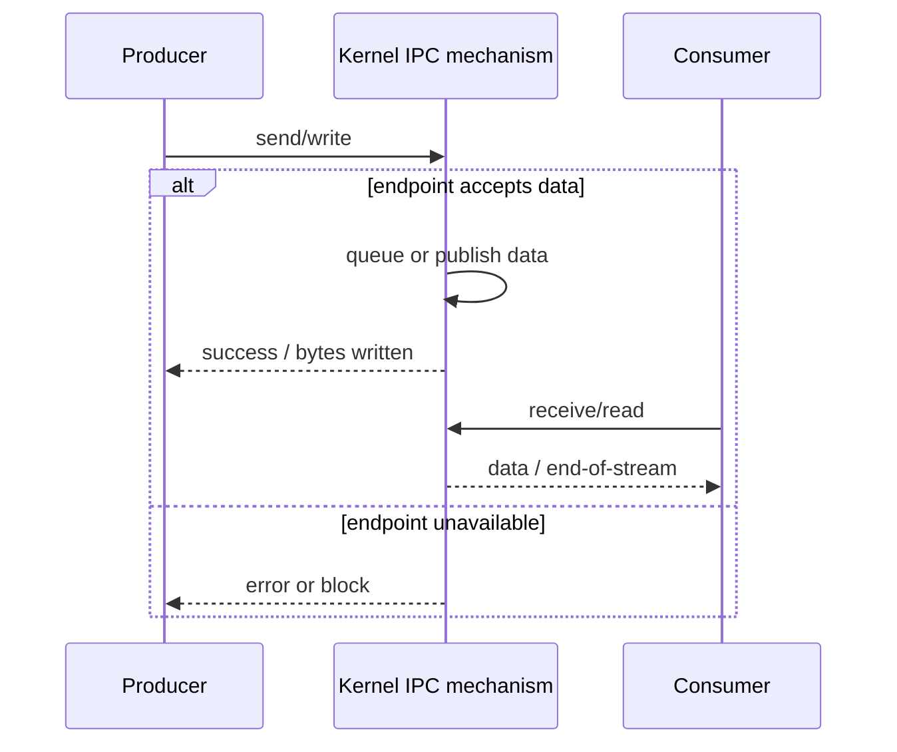

# Interprocess Communication

## Table of Contents

1. [Introduction](#1-introduction)
2. [Cooperating Processes](#2-cooperating-processes)
3. [Shared Memory](#3-shared-memory)
4. [Message Passing](#4-message-passing)
5. [Signals](#5-signals)
6. [Communication Costs](#6-communication-costs)
7. [IPC Boundaries and Failure Cases](#7-ipc-boundaries-and-failure-cases)
8. [Concrete Architecture Examples](#8-concrete-architecture-examples)
9. [Summary](#9-summary)

## 1. Introduction

This document describes interprocess communication (IPC). The document covers cooperating processes, shared memory, message passing, signals, mailboxes, ports, and sockets. The document does not cover synchronization algorithms or the internal implementation of specific IPC mechanisms.

## 2. Cooperating Processes

Processes are isolated by default. A process can be **independent** or **cooperating**. Cooperating processes exchange information or coordinate their activities.

Cooperation can support parallel execution. A large task can be divided into smaller tasks that execute at the same time on systems with multiple processors or cores. Cooperation can also support modular system design by assigning separate functions to separate processes.

## 3. Shared Memory

**Shared memory** allows processes to access a common memory region. The operating system can create the region and map it into the address spaces of the participating processes through system calls. After setup, each process can read and write the shared region directly.

The operating system establishes access to the region but does not define the application-level data format stored there. Cooperating processes must agree on the data types, layout, synchronization protocol, and locations used to exchange data. If processes interpret the same bits differently or use different locations, the data can be misinterpreted. On Linux, POSIX shared memory can be created with `shm_open`, sized with `ftruncate`, and mapped with `mmap`; the resulting object can be mapped into multiple processes. [Linux `shm_overview(7)`](https://man7.org/linux/man-pages/man7/shm_overview.7.html)

Processes must coordinate access to shared data. Unsynchronized access in which one process writes while another reads or writes can produce a **race condition**. Synchronization mechanisms are required when concurrent access could produce inconsistent results.

A producer-consumer arrangement is one shared-memory pattern. A producer writes data to a shared area. A consumer reads that data according to an agreed format and location.

Chromium-based browsers provide an example of process modularity. A browser process can manage the user interface and input/output, while renderer processes handle web content. Separate renderer processes can limit the effects of a failure in one tab. The exact process arrangement depends on the browser version and configuration.

## 4. Message Passing

**Message passing** allows processes to exchange data through operating-system communication mechanisms without sharing an address space. Common mechanisms include pipes, sockets, and remote procedure calls.

In a mailbox model, the operating system establishes a communication endpoint and manages queued messages. A sending process requests that a message be delivered, and a receiving process requests the next available message. The exact blocking, queue-size, and message-boundary semantics depend on the IPC interface. For example, a Unix pipe is a byte stream rather than a message queue, so it does not preserve application-defined message boundaries. Linux documents pipes as unidirectional channels with separate read and write ends. [Linux `pipe(7)`](https://man7.org/linux/man-pages/man7/pipe.7.html)

The Mach operating system uses **ports** as message endpoints. A process sends messages to a port, and another process can receive them. A listening port can receive connection requests used to establish private communication links.

Sockets provide an interface for communication between processes on the same machine or across a network. A socket is not inherently a message queue: stream sockets provide an ordered byte stream, while datagram sockets preserve datagram boundaries. In network communication, an IP address identifies a network endpoint and a transport-layer port identifies a service endpoint within the host. Client and server refer to communicating roles; they do not necessarily refer to separate machines. Linux documents the socket API as the interface between user processes and kernel protocol stacks. [Linux `socket(7)`](https://man7.org/linux/man-pages/man7/socket.7.html)

## 5. Signals

A **signal** is an asynchronous notification sent to a process or thread. On Unix-like systems, a signal can interrupt a process that is executing, including a process that is executing an unbounded loop. The signal does not contain an application-defined message payload.

A process can use the default action for a signal, ignore a signal when permitted, or install a signal handler. Default actions include termination for some signals. For example, pressing `Ctrl+C` in a terminal commonly causes the terminal's foreground process group to receive `SIGINT`, whose default action is process termination. A process can install a handler for `SIGINT` and choose another response.

On Linux, `SIGKILL` and `SIGSTOP` cannot be caught, blocked, or ignored by a user process. `SIGKILL` terminates the target process, while `SIGSTOP` suspends it. Signal behavior and names outside these defined interfaces depend on the operating system.

## 6. Communication Costs

Shared memory requires system calls to create and map the region. After setup, processes access shared data without a system call for each read or write. This can reduce communication overhead, but processes must manage data formats and synchronization.

Message passing typically requires operating-system involvement for sending and receiving messages. This adds system-call and data-transfer overhead. Message passing keeps address spaces separate and provides a communication interface managed by the operating system.

## 7. IPC Boundaries and Failure Cases

An IPC operation has both a communication state and an error state. A sender can encounter a full queue, a closed endpoint, an invalid descriptor, or insufficient permission. A receiver can encounter an empty queue, end-of-file, an interrupted blocking operation, or an invalid endpoint. Correct IPC code must distinguish these cases instead of treating every non-success result as an ordinary message.

For a shared-memory producer-consumer protocol, the communication region itself does not prevent concurrent access. A synchronization protocol must establish when a producer may publish an item and when a consumer may read it. POSIX semaphores are one mechanism that can coordinate processes and threads; Linux documents `sem_wait` as potentially blocking when the semaphore value is zero. [Linux `sem_overview(7)`](https://man7.org/linux/man-pages/man7/sem_overview.7.html)

A generic bounded message exchange can therefore be modeled as follows:

```text
SEND(endpoint, message):
    if endpoint is invalid:
        return INVALID_ENDPOINT
    if message is too large:
        return MESSAGE_TOO_LARGE
    if endpoint is closed:
        return CLOSED
    if queue is full and operation is nonblocking:
        return WOULD_BLOCK
    enqueue(message)
    notify_receiver_if_required()
    return SUCCESS

RECEIVE(endpoint):
    if endpoint is invalid:
        return INVALID_ENDPOINT
    if queue is empty and operation is nonblocking:
        return WOULD_BLOCK
    if queue is empty and operation is blocking:
        wait_until_message_or_close()
    if endpoint is closed and queue is empty:
        return END_OF_STREAM
    return dequeue()
```

The model deliberately leaves the synchronization and kernel implementation abstract. The important architectural distinction is that the two processes do not directly dereference each other's private virtual addresses. An IPC mechanism establishes a controlled interface through which data or notifications cross the process boundary.

A pipe also illustrates an important boundary case. When every file descriptor referring to the write end has been closed, a Linux pipe reader observes end-of-file. If all read ends have been closed, a writer receives `SIGPIPE` and the write fails with `EPIPE` when the signal is ignored or handled in a way that permits the call to return. [Linux `pipe(7)`](https://man7.org/linux/man-pages/man7/pipe.7.html)

## 8. Concrete Architecture Examples

The processor does not require a special instruction for every IPC abstraction. User programs normally invoke ordinary function calls and system-call entry mechanisms, after which the operating system performs the privileged operations needed by the selected IPC facility.

### 8.1 x86-64

A Linux x86-64 program can enter the kernel with `syscall`. For example, the following fragment illustrates the architectural boundary for a `write` request; the system-call number and argument registers follow the Linux x86-64 system-call ABI described earlier in the book. The example shows the ISA mechanism, not the internal implementation of the pipe, socket, or shared-memory operation.

```asm
; ssize_t write(int fd, const void *buf, size_t count)
mov     eax, 1          ; __NR_write
mov     edi, 1          ; stdout
lea     rsi, [rip + msg]
mov     edx, 6
syscall
; RAX contains the return value

msg: .ascii "hello\n"
```

The `syscall` instruction transfers control to the operating system; it does not itself define whether the requested resource is a pipe, socket, file, or other object. The system-call interface and the kernel object determine that behavior.

### 8.2 AArch64

AArch64 Linux uses `svc` for synchronous supervisor calls. The following fragment illustrates the same architectural boundary for a `write` request.

```asm
// ssize_t write(int fd, const void *buf, size_t count)
mov     x0, #1          // stdout
adrp    x1, msg
add     x1, x1, :lo12:msg
mov     x2, #6
mov     x8, #64         // __NR_write on Linux AArch64
svc     #0
// x0 contains the return value

msg: .ascii "hello\n"
```

`svc` is the architectural exception mechanism. The operating system's system-call ABI assigns the system-call number and arguments to registers; the instruction itself does not encode the meaning of `write`.

### 8.3 Architecture data

| Interface | x86-64 Linux | AArch64 Linux |
| --- | --- | --- |
| System-call entry instruction | `syscall` | `svc #0` |
| System-call number register | `RAX` | `X8` |
| First argument | `RDI` | `X0` |
| Second argument | `RSI` | `X1` |
| Third argument | `RDX` | `X2` |
| Typical return register | `RAX` | `X0` |

The table describes the Linux system-call ABI, not a universal property of the x86-64 or AArch64 instruction sets.

### 8.4 IPC sequence



The diagram is deliberately generic. Shared memory differs because the data transfer after setup can occur through ordinary memory accesses rather than through a kernel-mediated copy on every operation.

## 9. Summary

This document describes interprocess communication through shared memory, message passing, and signals. Shared memory provides direct access to a common region and requires agreed data layouts and synchronization. Message passing uses controlled operating-system interfaces such as pipes, mailboxes, ports, and sockets; their message-boundary and blocking semantics differ. Signals provide asynchronous notifications with defined default and handler actions. The concrete examples show that IPC crosses the process boundary through operating-system interfaces even though the CPU executes ordinary instructions to enter those interfaces. The chapter does not attempt to specify the internal implementation of each IPC mechanism.
