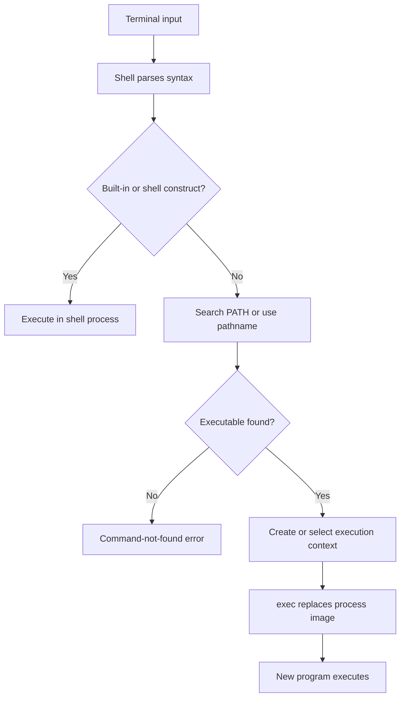

# Shells and File-System Objects

## Table of Contents

1. [Introduction](#1-introduction)
2. [Terminal Emulators and Shells](#2-terminal-emulators-and-shells)
3. [Shell Commands and Processes](#3-shell-commands-and-processes)
4. [Shell Variables and Environments](#4-shell-variables-and-environments)
5. [Command Lookup](#5-command-lookup)
6. [Environment and Path Security](#6-environment-and-path-security)
7. [Command Documentation](#7-command-documentation)
8. [Pathnames](#8-pathnames)
9. [Directories and Names](#9-directories-and-names)
10. [File Metadata and Data](#10-file-metadata-and-data)
11. [Hard Links](#11-hard-links)
12. [Symbolic Links](#12-symbolic-links)
13. [Working Directories](#13-working-directories)
14. [Application Bundles](#14-application-bundles)
15. [Command Execution Model](#15-command-execution-model)
16. [Path Resolution Model](#16-path-resolution-model)
17. [Concrete Architecture and File-System Data](#17-concrete-architecture-and-file-system-data)
18. [Summary](#18-summary)

## 1. Introduction

This document describes terminal emulators, shells, process environments, command lookup, pathname resolution, and file-system objects. The document covers how a shell starts commands, how the `PATH` variable affects executable search, and how paths identify file-system objects. The document does not specify the syntax or behavior of a particular shell or file-system format.

## 2. Terminal Emulators and Shells

A **terminal emulator** provides a text interface and displays input and output. It commonly connects programs through a pseudoterminal. A **shell** is a separate program that reads command input and interprets shell syntax.

The operating system can process terminal input as bytes, but it does not interpret shell commands as human-readable instructions. The shell parses commands and uses operating-system interfaces to perform operations or start other programs. A terminal emulator handles presentation and terminal communication; it does not normally parse shell syntax.

## 3. Shell Commands and Processes

A shell can recognize built-in commands, aliases, functions, and external programs. Built-ins run as part of the shell process. They can change shell state, such as the current directory or shell variables.

For an external command, the shell resolves the command and starts a process using operating-system mechanisms. On Unix-like systems, this commonly involves creating or reusing a process and calling an `exec` function to load the selected program. Exact process-creation mechanisms differ across operating systems and shells.

A program is stored data, while a process is an executing instance with operating-system state and memory. A command can also name a shell function, built-in, or script rather than a native executable file.

## 4. Shell Variables and Environments

A **shell variable** associates a name with a value in the shell's state. Shell syntax can substitute a variable's value into a command before the command runs. Shell variables are distinct from a process's exported environment.

When a shell starts an external program, it passes environment variables to the new program. On Unix-like systems, an environment is conventionally represented as strings containing names and values. A child process receives its own environment state. Changes made by the child do not update the parent shell, and later changes in the shell do not update a child that is already running. A child can pass selected environment values to its own child processes.

Shells provide syntax such as `export` to mark variables for inclusion in the environment of subsequently started commands. Exact syntax and inheritance details vary by shell and operating system. In C programs, `getenv` is a common interface for reading an environment value. A third `envp` parameter to `main` is available on some systems but is not part of the ISO C standard interface.

The `SHELL` environment variable commonly identifies a user's configured shell. It does not necessarily identify the shell process currently interpreting a command. The environment passed to a child process is a snapshot of the exporting process's environment at process-image creation; later changes in either process do not retroactively modify the other process's environment.

## 5. Command Lookup

When a command name does not specify a path, a shell may search directories listed in the `PATH` environment variable. On Unix-like systems, `PATH` is commonly a colon-separated string. On Windows, path entries are commonly separated by semicolons. Search order and command-resolution rules depend on the shell and platform.

Shell command resolution can consider shell constructs such as aliases, functions, and built-ins before searching for an external program. When searching `PATH`, the shell checks directories in order and selects a matching executable according to its platform rules. A command containing a path separator can bypass a `PATH` search.

Utilities such as `which` can report a path for an external command, but their behavior and availability vary. Shell built-ins such as `command -v` or `type` can report how the current shell resolves a command. Some shells cache successful command lookups.

## 6. Environment and Path Security

The current directory is not included in `PATH` by default in many Unix-like environments. This reduces the chance that a file in the current directory will run instead of a trusted program with the same name. Adding the current directory to `PATH` changes command resolution according to its position in the search list.

Environment variables influence child programs. Programs that consume environment values must validate them when those values affect file paths, executable selection, or other security-sensitive behavior.

## 7. Command Documentation

Many Unix-like systems provide manual pages for installed commands and system interfaces. A manual page describes the version available on that system. The `man` command commonly opens these pages in a pager, but exact documentation tools and controls vary by platform.

## 8. Pathnames

A **pathname** identifies a directory entry through a sequence of name components. Multiple pathnames can resolve to the same file object, and a file object can have multiple directory entries. On Unix-like systems, the slash character separates components. An absolute pathname begins at the root directory. A relative pathname begins at the working directory of the process performing the operation.

The components `.` and `..` conventionally refer to the current directory and its parent directory. Path resolution processes components in order through the file-system namespace. A missing or inaccessible component can cause resolution to fail before later components are considered. The operating system may cache or optimize lookups; the pathname is not a direct disk address.

On Unix-like systems, a pathname component cannot contain a slash or a zero byte. Other byte values can occur in names, subject to file-system and interface limits. POSIX defines pathname resolution in terms of directory-entry lookup and symbolic-link substitution rather than physical disk addresses. A leading dot has no special meaning to the file system; utilities such as `ls` conventionally omit names that begin with a dot unless requested to show them.

## 9. Directories and Names

A **directory** associates names with file-system objects. In inode-based file systems, a directory entry commonly maps a name to an inode number. This structure allows a path to be resolved one component at a time without storing every object's complete pathname in its metadata.

On traditional Unix-like systems, directories commonly expose entries named `.` and `..` for the directory itself and its parent. The root directory's parent resolves to the root. File-system implementations can represent these relationships differently.

A directory is a distinct file type, not a regular file containing user text. Utilities such as `ls` request directory entries through operating-system interfaces. Reading a directory with a regular-file utility such as `cat` is not a portable way to inspect its contents.

## 10. File Metadata and Data

An **inode** is a metadata record used by many Unix-like file systems. On an inode-based file system, it can store a file's type, owner, permissions, size, timestamps, link count, and references to its data. An inode is not a universal file-system structure; other file systems use different metadata models. The exact fields and data layout depend on the file system. Other file systems can use different metadata structures.

In an inode-based file system, a directory entry stores a name and an inode reference. The inode does not store the directory-entry name. One inode can therefore have multiple names. File data can occupy multiple noncontiguous storage blocks, and some file-system objects do not represent ordinary disk data.

The `stat` interface reports metadata for a pathname or file descriptor. A name shown by a command can come from the pathname supplied to that command; it is not necessarily a field stored in the inode.

## 11. Hard Links

A **hard link** is a directory entry that refers to the same inode as another entry. The two names identify the same file object and share its metadata and data. Creating a hard link does not copy the file contents.

Removing a name with an unlink operation removes that directory entry and decreases the inode's link count. The file's storage can be reclaimed after its link count reaches zero and no open references remain. An open file can remain accessible through a file descriptor after its last directory entry has been removed.

Hard links generally cannot cross file-system boundaries. Creating hard links to directories is restricted on many systems to prevent cycles in the directory hierarchy.

## 12. Symbolic Links

A **symbolic link** is a separate file-system object whose contents identify a target pathname. During path resolution, the operating system follows the target and continues resolving its components. A relative target is interpreted relative to the directory containing the symbolic link.

A symbolic link can refer to a target that does not exist. Such a link is dangling until a matching target is created. Cycles among symbolic links prevent successful resolution and cause an error when a path is followed.

Unlike a hard link, a symbolic link does not refer directly to the target inode. Removing the symbolic link removes the link object and does not remove the target.

## 13. Working Directories

Each process has a working directory used as the starting point for relative pathnames. The operating system maintains this state for the process. A newly created child process commonly inherits its parent's working directory, and changing the child's working directory does not change the parent's.

A shell's `cd` command changes the working directory of the shell process. It is normally implemented as a shell built-in because a separate child process could change only its own working directory before exiting. On Unix-like systems, a process changes its working directory through an operating-system interface such as `chdir`.

The `PWD` environment variable is a shell-maintained representation of the working directory. It is not the operating system's authoritative process state and can preserve a logical pathname containing symbolic links. A physical-path query resolves symbolic links; command names and options for this behavior vary by shell and platform.

## 14. Application Bundles

An **application bundle** groups an executable, metadata, libraries, configuration, and other resources in a directory hierarchy. On macOS, the graphical interface presents many application bundles as single applications even though the file-system object is a directory. Metadata such as `Info.plist` helps the operating system and graphical tools identify the application and its resources.

Application installation can also update operating-system integration outside the application directory. On Windows, installation and registration mechanisms can copy application files and register executable paths, file associations, shortcuts, or uninstall information. Windows does not require every application to use a traditional installer; packaged applications use additional manifest and registration mechanisms. These integration steps are distinct from storing the executable and resources on disk, and the exact requirements depend on the application and operating system.

## 15. Command Execution Model

A Unix-like shell commonly performs command execution through a sequence that separates command interpretation from process-image replacement. Built-ins execute in the shell process when they need to modify shell state. External commands are normally resolved to an executable pathname and then executed through an operating-system interface such as `execve` or one of the `exec` functions. A successful `exec` replaces the calling process image rather than creating an additional process. POSIX specifies that the `exec` family does not return on success.

```text
function RUN_COMMAND(command, shell_state):
    parsed = PARSE_SHELL_SYNTAX(command)
    if parsed is invalid:
        return SHELL_SYNTAX_ERROR

    if parsed names a builtin:
        return RUN_BUILTIN(parsed, shell_state)

    path = RESOLVE_COMMAND(parsed.name, shell_state.PATH)
    if path is not found:
        return COMMAND_NOT_FOUND

    result = EXECUTE(path, parsed.arguments, shell_state.environment)
    if result == success:
        return NEVER_RETURNS_TO_OLD_IMAGE
    return EXECUTION_ERROR
```

The pseudocode distinguishes the shell's parsing state from the operating system's process-image operation. A real shell also handles redirection, pipelines, job control, signals, functions, aliases, and shell-specific syntax; those mechanisms are outside this chapter's scope. POSIX specifies `execvp()` and related functions as interfaces that can search `PATH` when the file argument contains no slash. [POSIX exec functions](https://pubs.opengroup.org/onlinepubs/9799919799/functions/exec.html)

The following x86-64 example shows the architectural boundary for a Linux `execve` system call. The register convention is Linux-specific; the `syscall` instruction is the processor-level transition mechanism. The example assumes that `path`, `argv`, and `envp` already contain valid pointers.

```asm
; Linux x86-64: execve(path, argv, envp)
mov     rax, 59              ; __NR_execve
lea     rdi, [rip + path]    ; const char *path
lea     rsi, [rip + argv]    ; char *const argv[]
lea     rdx, [rip + envp]    ; char *const envp[]
syscall
; On return, rax contains a negative error value encoded by the kernel ABI.
```

On AArch64 Linux, the corresponding transition uses `svc #0` and places the system-call number in `x8`; Linux assigns `__NR_execve` the value 221 for the AArch64/generic system-call table. [Linux AArch64 syscall definitions](https://github.com/torvalds/linux/blob/master/arch/arm64/include/uapi/asm/unistd.h) [Linux generic syscall table](https://github.com/torvalds/linux/blob/master/include/uapi/asm-generic/unistd.h)

```asm
// Linux AArch64: execve(path, argv, envp)
mov     x8, #221             // __NR_execve
adr     x0, path              // const char *path
adr     x1, argv              // char *const argv[]
adr     x2, envp              // char *const envp[]
svc     #0
// A successful exec does not return to this instruction stream.
```

### 15.1 Command Dispatch Sequence

The command-dispatch path can be represented as a sequence from terminal input to shell parsing, command resolution, and process-image execution. Built-ins terminate the external-command path because they execute inside the shell process.



## 16. Path Resolution Model

Path resolution can be modeled as a walk through directory entries. An absolute pathname starts at the process's root directory. A relative pathname starts at the process's current working directory. Each component is resolved against the directory reached by the preceding component. A missing component, an inaccessible directory, a non-directory intermediate component, or an excessive symbolic-link chain can terminate the walk with an error. POSIX specifies this model, including the treatment of `.`, `..`, and symbolic links. [POSIX pathname resolution](https://pubs.opengroup.org/onlinepubs/9799919799/basedefs/V1_chap04.html)

```text
function RESOLVE_PATH(start, components):
    current = start

    for component in components:
        if component == ".":
            continue
        if component == "..":
            current = PARENT(current)
            continue

        entry = LOOKUP(current, component)
        if entry is missing:
            return NOT_FOUND
        if entry is inaccessible:
            return PERMISSION_DENIED

        if entry is a symbolic link:
            if TOO_MANY_SYMLINKS:
                return LOOP_ERROR
            current = RESOLVE_TARGET(entry)
        else:
            current = entry

    return current
```

Linux documents the same walk explicitly and reports `ELOOP` when symbolic-link resolution exceeds its limit. The Linux path-resolution implementation currently limits symbolic-link traversal to 40 resolutions for one pathname. [Linux pathname resolution](https://www.man7.org/linux/man-pages/man7/path_resolution.7.html)

## 17. Concrete Architecture and File-System Data

| Mechanism | Concrete data | Scope |
| :--- | :--- | :--- |
| POSIX `PATH` | Colon-separated search prefixes on Unix-like systems | Shell convention and POSIX environment interface |
| POSIX `execve` | `path`, `argv[]`, `envp[]`; successful call replaces the process image | Process execution interface |
| Linux x86-64 `execve` | System-call number 59; transition through `syscall` | Linux x86-64 ABI |
| Linux AArch64 `execve` | System-call number 221; transition through `svc #0` | Linux AArch64 ABI |
| Linux hard link | Additional directory name referring to the same file object; cannot cross file-system boundaries | Linux file-system interface |
| Linux symbolic link | Separate file-system object containing a target pathname | Linux file-system interface |
| macOS application bundle | Directory hierarchy containing an `Info.plist` file and application resources | macOS bundle convention |
| Windows application registration | Registry entries can map executable names and file types to applications | Windows Shell integration |

Linux documents hard links as additional names for an existing file and states that `link()` cannot cross file systems. Linux `unlink()` removes a name; storage can be reclaimed after the final link is removed and no process retains the file open. [Linux link(2)](https://man7.org/linux/man-pages/man2/link.2.html) [Linux unlink(2)](https://man7.org/linux/man-pages/man2/unlink.2.html)

Apple documents `Info.plist` as the information property list associated with a bundle. For macOS application bundles, the file is located in the bundle's `Contents` directory. [Apple Information Property List](https://developer.apple.com/documentation/bundleresources/information-property-list)

Microsoft documents application registration through registry locations such as `App Paths` and file-association registrations. The Windows Shell can use these registrations to locate executables and determine which application handles a file type. [Microsoft Application Registration](https://learn.microsoft.com/en-us/windows/win32/shell/app-registration) [Microsoft File Associations](https://learn.microsoft.com/en-us/windows/win32/shell/fa-how-work)

## 18. Summary

This document describes terminal emulators, shell command interpretation, process environments, variable export, `PATH` lookup, command documentation, pathname resolution, directory entries, inode-based metadata, file data, hard links, symbolic links, process working directories, and application bundles. Shell syntax is interpreted by the shell, while operating-system interfaces perform process and file operations. The document distinguishes user-space presentation from kernel file-system state and treats Unix-like inode terminology as an implementation model rather than a universal file-system requirement. The document does not specify the complete syntax or behavior of a particular shell or file-system format.
